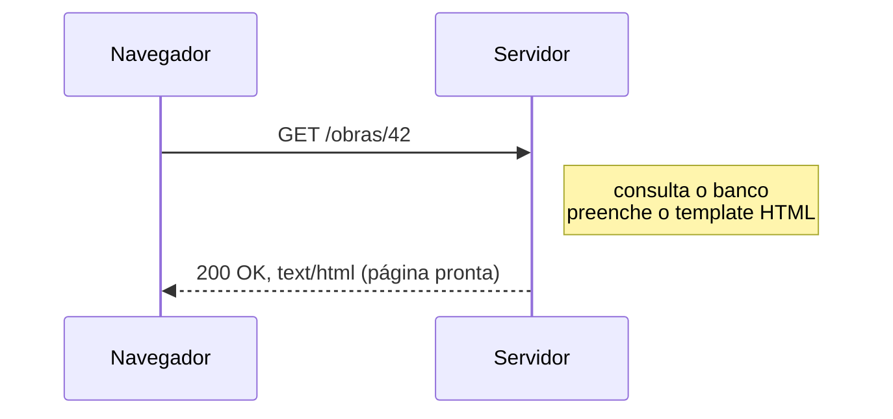
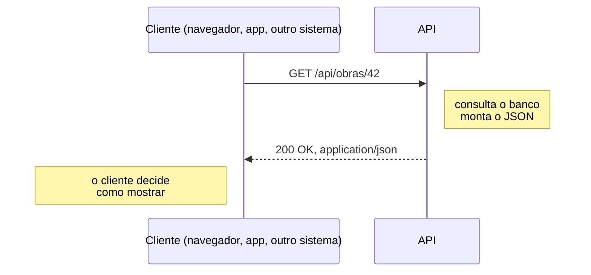
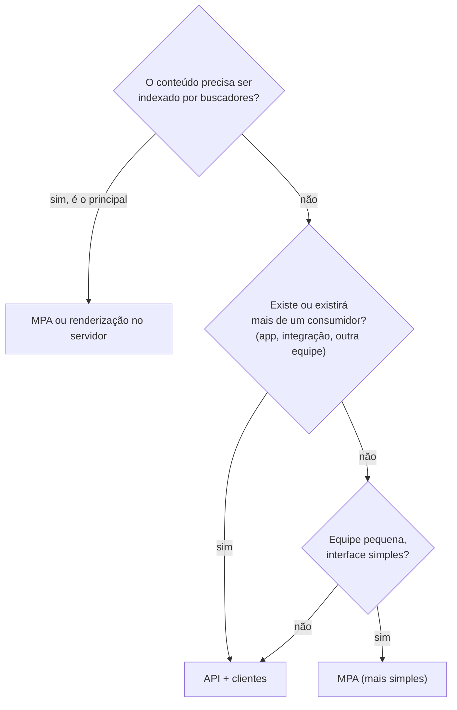
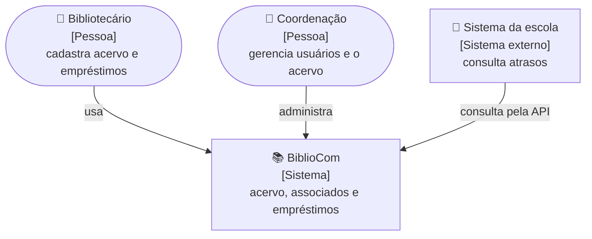
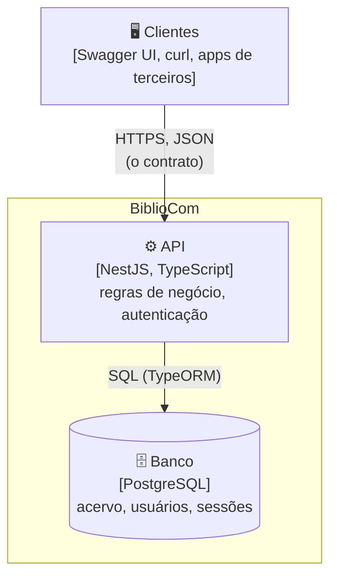
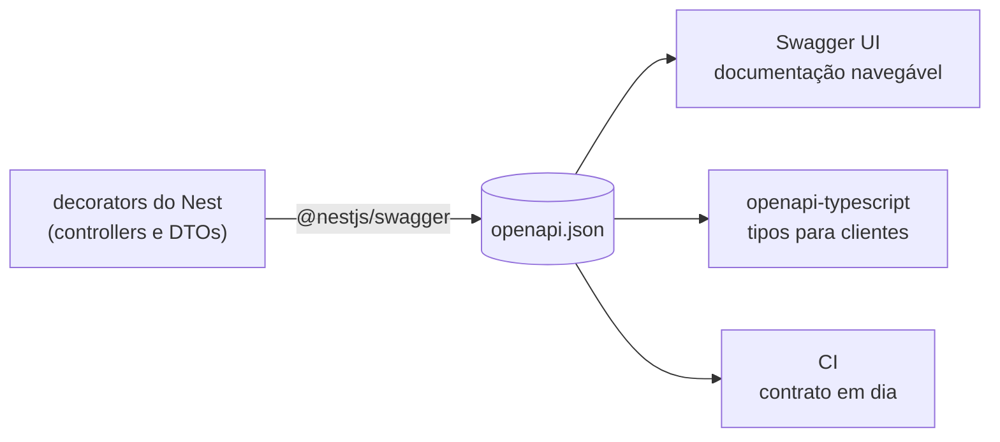

# M02 — Arquitetura desacoplada e contrato de API

> **Pré-requisito:** M01 · **Duração:** curta
> **Ementa:** *Introdução a aplicações web: como funcionam.*

Módulo curto e inteiramente conceitual — e um dos mais importantes. Ele responde à
pergunta que o resto do curso executa: **quem monta a tela, quem guarda a verdade, e como
os dois combinam o que vão trocar?**

## 🎯 Objetivos

1. Comparar renderização no servidor (MPA) e aplicações que consomem uma API.
2. Escolher entre as duas a partir de requisitos, não de preferência.
3. Desenhar a arquitetura de um sistema com o **C4 Model**, em diagramas como código.
4. Explicar o que é o **contrato** entre cliente e servidor e por que ele vem primeiro.
5. Projetar os recursos e as rotas de uma API REST a partir de um domínio.

## 🧭 Por que este módulo vem antes do backend

Pense num **restaurante com serviço de entrega**. A cozinha não sabe se o pedido veio pelo
salão, pelo telefone ou por um aplicativo — e não precisa saber. O que todos compartilham é
o **cardápio**: o que existe, como pedir, o que chega. A cozinha pode trocar de fogão sem
avisar ninguém; se trocar o cardápio sem avisar, todo canal de pedido quebra.

Numa arquitetura desacoplada, o servidor é a cozinha (a regra de negócio e os dados), os
clientes são os canais (navegador, aplicativo, outro sistema) e a **API** é o cardápio.

Este curso constrói **a cozinha**: uma API completa, documentada, segura e no ar. Os clientes
ficam fora do escopo da disciplina — e é justamente por isso que o cardápio precisa ser
impecável: quem consumir a API vai conhecê-la **só** por ele.

> Em outras palavras, o M02 ensina a pensar no contrato antes de escrever rotas. Isso reduz
> retrabalho e evita o clássico erro de "escrever o backend sem definir o que quem vai usar
> precisa de verdade".

---

## 📖 Teoria

### 1. Duas formas de montar uma tela

#### Renderização no servidor (MPA — *multi-page application*)



Cada navegação é uma requisição nova, e o servidor devolve **HTML completo**. É como
funcionam Rails com ERB, Laravel com Blade e PHP tradicional.

#### Cliente que consome uma API



O servidor entrega **dados**; quem consome decide como apresentá-los. A mesma resposta serve
a uma tela web, a um aplicativo e a uma integração com outro sistema.

#### Comparação honesta

| Critério | MPA (servidor monta a tela) | API + clientes |
| --- | --- | --- |
| Primeiro carregamento | Rápido | Depende do cliente |
| Funciona sem JavaScript | ✅ Sim | Depende do cliente |
| SEO | ✅ Nativo | Exige cuidado extra no cliente web |
| Complexidade | Baixa: um projeto | Maior: API e clientes, cada um com seu deploy |
| Serve app mobile e integrações | Não (precisa de API à parte) | ✅ A mesma API |
| Equipes separadas | Difícil | ✅ Fácil (contrato claro) |
| Custo de manutenção | Menor | Maior |

**Não existe opção certa em abstrato.** Existe a opção certa para um conjunto de
requisitos. Um blog institucional servido por API e cliente pesado é má engenharia; um
sistema consumido por três aplicativos diferentes, cada um com seu HTML, também.

#### Como escolher



> **O BiblioCom cabe nos dois modelos.** O curso adota **API + clientes** porque a
> organização parceira típica de um projeto extensionista precisa integrar sistemas, e
> porque é o que o mercado de backend pede. A decisão e o custo estão registrados em
> [`decisoes-tecnicas.md`](../../docs/decisoes-tecnicas.md#adr-10--backend-em-typescript-com-frontend-opcional-nestjs--typeorm).
> Reconhecer que a alternativa era viável é parte de decidir bem.

💼 **No mercado:** essa é uma pergunta real de entrevista e de reunião de arquitetura.
Responder "API, porque é moderno" desqualifica; responder com os requisitos qualifica.

### 2. Desenhar a arquitetura: o C4 Model

Para conversar sobre arquitetura, a equipe precisa de **desenhos** — e de desenhos que todo
mundo leia do mesmo jeito. O **C4 Model** organiza isso como um **mapa com zoom**: primeiro o
país, depois a cidade, o bairro, a rua. Cada nível responde a uma pergunta, e ninguém mistura
os níveis num desenho só.

| Nível | Pergunta | Para quem |
|---|---|---|
| **1. Contexto** | Quem usa o sistema, e com que outros sistemas ele conversa? | Qualquer pessoa, inclusive a organização parceira |
| **2. Contêineres** | Quais peças executáveis existem (API, banco, aplicativos)? | A equipe técnica |
| **3. Componentes** | Quais módulos existem dentro de uma peça? | Quem desenvolve aquela peça |
| 4. Código | Quais classes? | Raramente desenhado: o próprio código responde |

**Nível 1 — Contexto do BiblioCom:**



**Nível 2 — Contêineres:**



O nível 3 — os módulos `acervo`, `emprestimos`, `auth` dentro da API — aparece no M03 e
cresce até o M08.

> **Por que Mermaid?** Estes diagramas são **texto** dentro do Markdown. O GitHub os
> desenha, o Git versiona, e uma mudança na arquitetura aparece num *diff* como qualquer
> código. Desenho em imagem envelhece em silêncio; desenho como código é revisado no
> *pull request*.

### 3. O que muda quando se desacopla

Separar cliente e servidor não elimina trabalho — **desloca** trabalho. O que antes era uma
chamada de função vira uma requisição de rede, com tudo que isso implica.

| Preocupação | MPA | API + clientes |
| --- | --- | --- |
| Validação | Uma vez, no servidor | No cliente (conforto) **e** no servidor (segurança) |
| Autenticação | Sessão + cookie, direto | Sessão em cookie ou token, escolhido por tipo de cliente (M08) |
| Erros | Página de erro | Cada requisição pode falhar, e o erro precisa de formato previsível |
| Deploy | Um artefato | API e clientes evoluem separados — e o contrato entre eles precisa aguentar |
| Documentação | Opcional | **Obrigatória**: quem consome não lê o seu código |

Três consequências que a turma vai sentir na pele:

1. **Validar no cliente não é validar.** O `curl` do M01 já provou que dá para pular
   qualquer interface. A validação do servidor é a única que você controla sempre — e é a
   do M07.
2. **Toda resposta pode ser erro.** Quem consome precisa saber, para cada rota, quais erros
   esperar e em que formato — por isso o formato de erro é parte do contrato.
3. **O contrato pode quebrar em silêncio.** O backend renomeia `titulo` para `nome`, a API
   continua respondendo `200`, e o cliente mostra `undefined`. As defesas: contrato gerado do
   código (M03, M07), tipos gerados e verificados (M11), testes (M10).

### 4. O contrato de API ⭐

O contrato é o acordo sobre **quais recursos existem, em quais URLs, com quais métodos, em
que formato e com quais erros**. Ele vem **antes** do código — é o que permite a API e seus
consumidores avançarem em paralelo.

#### Recursos, não ações

A URL nomeia **coisas** (substantivos); o método diz o que se faz com elas (verbos). Isso é
o M01 aplicado.

| ❌ Verbo na URL | ✅ Recurso + método |
| --- | --- |
| `GET /criarObra` | `POST /api/obras` |
| `POST /atualizarObra?id=42` | `PATCH /api/obras/42` |
| `GET /deletarObra/42` | `DELETE /api/obras/42` |
| `GET /listarObrasDoAutor/7` | `GET /api/obras?autorId=7` |
| `POST /login` | `POST /api/sessao` — o recurso é a sessão |
| `POST /devolverEmprestimo/15` | `POST /api/emprestimos/15/devolucao` ✅ |

A última linha mostra a exceção legítima: quando a operação **não** é um CRUD simples, uma
sub-rota com substantivo ("a devolução do empréstimo 15") é aceitável e mais clara que
forçar um `PATCH`.

#### O contrato do BiblioCom

| Recurso | Método | Rota | O que faz | Sucesso | Módulo |
| --- | --- | --- | --- | --- | --- |
| Obras | GET | `/api/obras` | Lista, com busca e paginação | 200 | M06, M07 |
| | POST | `/api/obras` | Cria | 201 | M07 |
| | GET | `/api/obras/{id}` | Detalha | 200 | M06, M07 |
| | PATCH | `/api/obras/{id}` | Atualiza parcialmente | 200 | M07 |
| | DELETE | `/api/obras/{id}` | Remove | 204 | M07 |
| Empréstimos | POST | `/api/emprestimos` | Registra empréstimo | 201 | M06, M10 |
| Sessão | POST | `/api/sessao` | Entra (login) | 200 | M08 |
| | GET | `/api/sessao` | Quem sou eu | 200 / 401 | M08 |
| | DELETE | `/api/sessao` | Sai (logout) | 204 | M08 |
| Usuários | POST | `/api/usuarios` | Cadastro pela coordenação | 201 | M08 |
| | GET | `/api/usuarios/{id}` | Consulta o próprio cadastro | 200 | M09 |
| Saúde | GET | `/api/health` | A API e o banco respondem? | 200 / 503 | M12 |

#### Formato das respostas

**Lista paginada** — o formato que o M06 implementa com `findAndCount`:

```json
{
  "itens": [
    { "id": 42, "titulo": "Dom Casmurro", "anoPublicacao": 1899, "autor": "Machado de Assis" }
  ],
  "total": 128,
  "pagina": 2,
  "tamanho": 20
}
```

Com `total` e `tamanho`, o cliente calcula sozinho quantas páginas existem (128 ÷ 20 = 7).

**Erro de validação** — o formato que o `ValidationPipe` do M07 devolve:

```json
{
  "message": [
    "titulo must be longer than or equal to 1 characters",
    "anoPublicacao must not be greater than 2100"
  ],
  "error": "Bad Request",
  "statusCode": 400
}
```

**Erro de domínio** — o formato das exceções do Nest (M03, M07):

```json
{ "message": "Obra 999 não encontrada", "error": "Not Found", "statusCode": 404 }
```

Repare que os dois erros têm a **mesma forma**: `message`, `error`, `statusCode`. A única
diferença é `message` ser lista na validação (várias falhas de uma vez) e texto nos demais.

O formato de erro **é parte do contrato**. Se cada rota errar de um jeito, cada cliente
precisa de um tratamento por rota — e não terá.

#### Decisões que o contrato precisa fixar

- [ ] Prefixo e versão (`/api/` ou `/api/v1/`)
- [ ] Barra final nas rotas — sim ou não, **consistentemente** (o NestJS não usa; mantenha)
- [ ] Convenção de nomes dos campos (`camelCase`, como o TypeScript)
- [ ] Formato de datas (**sempre** ISO 8601: `2026-08-11T14:32:07-03:00`)
- [ ] Formato de valores monetários (string decimal `"12.50"`, nunca `float`)
- [ ] Paginação: estilo e tamanho padrão
- [ ] Como se filtra, ordena e busca (`?busca=`, `?autorId=`, `?pagina=`, `?tamanho=`)
- [ ] Formato do erro de validação e do erro de permissão
- [ ] Relações: id (`"autorId": 7`) ou objeto aninhado (`"autor": {...}`)?

> A última decisão é a que mais gera retrabalho. Regra prática do material: **aninhe (ou
> resuma) na leitura, use id na escrita.** Quem lê quer o nome do autor sem uma segunda
> requisição; quem escreve só precisa mandar o id. Resolve-se com DTOs diferentes para
> leitura e escrita (M07, M09).

### 5. Documentação como fonte de verdade

O contrato só funciona se estiver escrito num lugar que **não pode divergir do código**. A
solução padrão é **OpenAPI** gerado a partir do próprio código:



Com isso, renomear um campo no DTO de saída muda o schema, que muda os tipos dos clientes,
que faz o TypeScript acusar erro **na compilação** — antes de chegar a qualquer usuário. É a
defesa concreta contra o problema da seção 3. Começa no M03, ganha corpo no M07 e vira
verificação automática no M11.

---

## 🛠️ Atividade dirigida

### Escrever o contrato do BiblioCom (em duplas)

1. Liste os recursos do domínio (use as entidades que você vai modelar no M04: autor, obra,
   categoria, exemplar, associado, empréstimo).
2. Para cada um, defina as rotas, os métodos e os status de sucesso.
3. Escreva o JSON de exemplo de uma listagem e de um detalhe.
4. Fixe as 9 decisões da seção 4.
5. Escreva 3 exemplos de erro: validação, não autenticado, sem permissão.
6. Desenhe os níveis 1 e 2 do C4 em Mermaid, com os nomes do **seu** sistema.

Guarde em `docs/contrato-api.md` no repositório. Este documento será confrontado com a
implementação real no M07 — e a diferença entre o que vocês projetaram e o que
implementaram é, ela mesma, o aprendizado.

---

## 🤖 IA no fluxo

Um assistente de IA é um bom parceiro para a atividade dirigida: descreva o domínio e peça
uma primeira versão do contrato, ou peça para ele **criticar** o seu ("encontre verbos na
URL, formatos inconsistentes e decisões que faltam"). Ele também escreve Mermaid com
facilidade.

O que fica com você: as decisões que dependem de quem vai usar a API. Se a escola parceira
precisa saber dos atrasos, isso vira um recurso — e nenhum modelo sabe disso sem você
perguntar à escola.

## ⚠️ Erros comuns

| Erro | Por que é problema |
| --- | --- |
| Escolher a arquitetura por moda | Complexidade sem contrapartida; o ADR existe para evitar isso |
| Verbo na URL (`/criarObra`) | Ignora a semântica do HTTP (M01) |
| Contrato só na cabeça de alguém | API e clientes divergem e ninguém percebe |
| Formato de erro diferente por rota | O cliente precisa de tratamento caso a caso |
| Data como `"11/08/2026"` | Ambíguo entre países; use ISO 8601 |
| Dinheiro como `float` | Erro de ponto flutuante; use string decimal |
| "Validamos no cliente, então está validado" | Não está. O `curl` ignora qualquer cliente |
| Diagrama misturando níveis do C4 | Pessoa, tabela do banco e classe no mesmo desenho: ninguém entende nada |

## 💣 Pegadinha de mercado

**Desenhar a API a partir das tabelas do banco.** É tentador: uma rota por tabela, um campo
por coluna. O resultado é uma API que expõe a estrutura interna — mudar o banco passa a
quebrar todos os clientes, e o cliente precisa de cinco requisições para montar uma tela. O
contrato nasce do que **quem consome precisa**, e o banco é detalhe de implementação do lado
de cá.

## ✅ Checklist de saída

- [ ] Sei explicar MPA × API + clientes sem usar a palavra "moderno"
- [ ] Sei escolher entre os dois a partir de requisitos
- [ ] Sei desenhar os níveis 1 e 2 do C4 de um sistema, em Mermaid
- [ ] Sei listar o que a arquitetura desacoplada **adiciona** de trabalho
- [ ] Escrevi o contrato de API do BiblioCom, com as 9 decisões fixadas
- [ ] Sei o que é OpenAPI e por que gerá-lo do código importa

## 🧩 Desafio de fixação

A escola do bairro quer que o sistema dela mostre, na ficha de cada aluno, se ele tem livro
atrasado na biblioteca. Desenhe o nível 1 do C4 com essa integração e escreva a rota que
você acrescentaria ao contrato — método, URL, resposta de sucesso e pelo menos um erro.
Quem pode chamar essa rota?

## 🧪 Exercícios

Ver [`exercicios.md`](exercicios.md).

## 📚 Para aprofundar

- [C4 Model](https://c4model.com/)
- [Mermaid — Flowcharts e diagramas de sequência](https://mermaid.js.org/intro/)
- [Roy Fielding — capítulo 5 da tese que definiu REST](https://ics.uci.edu/~fielding/pubs/dissertation/rest_arch_style.htm)
- [Microsoft — Boas práticas de design de API](https://learn.microsoft.com/pt-br/azure/architecture/best-practices/api-design)
- [OpenAPI Specification](https://spec.openapis.org/oas/latest.html)
