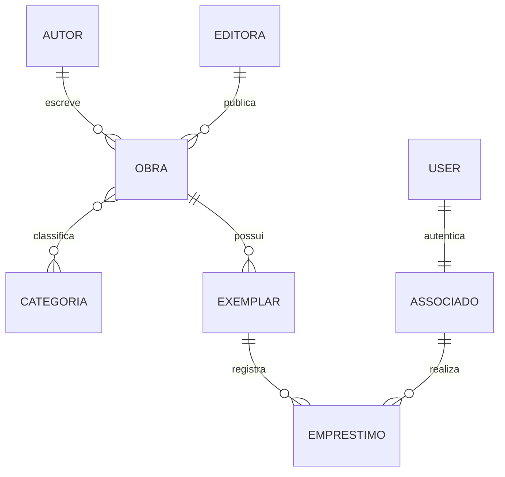

# M03 — Cheatsheet: Models

## Esqueleto

```python
from django.db import models


class MinhaEntidade(models.Model):
    # campos
    nome = models.CharField("rótulo", max_length=100)

    class Meta:
        verbose_name = "minha entidade"
        verbose_name_plural = "minhas entidades"
        ordering = ["nome"]
        constraints = [...]
        indexes = [...]

    def __str__(self):
        return self.nome

    def get_absolute_url(self):
        return reverse("app:detail", kwargs={"pk": self.pk})
```

## Campos

```python
# texto
models.CharField(max_length=100)
models.TextField(blank=True)
models.SlugField(unique=True)
models.EmailField()
models.URLField()

# números
models.IntegerField()
models.PositiveIntegerField()
models.DecimalField(max_digits=10, decimal_places=2)   # dinheiro
models.FloatField()                                     # NUNCA para dinheiro

# data/hora
models.DateField()
models.DateTimeField()
models.DateField(default=timezone.localdate)
models.DateTimeField(auto_now_add=True)   # só na criação
models.DateTimeField(auto_now=True)       # a cada save()
models.DurationField()

# lógico e arquivos
models.BooleanField(default=False)
models.FileField(upload_to="docs/%Y/%m/")
models.ImageField(upload_to="capas/")      # requer Pillow
models.UUIDField(default=uuid.uuid4, editable=False)
models.JSONField(default=dict)
```

## Opções

```python
null=True          # permite NULL no BANCO
blank=True         # permite vazio na VALIDAÇÃO
default=...        # valor padrão
unique=True        # restrição de unicidade
db_index=True      # índice
editable=False     # some dos formulários
choices=...        # conjunto fechado de valores
help_text="..."    # ajuda no form/admin
verbose_name="..." # rótulo (1º posicional)
```

**Regra do null/blank**

| Tipo | Opcional |
|---|---|
| `CharField`, `TextField` | `blank=True` |
| Numérico, data, FK | `null=True, blank=True` |
| `BooleanField` | `default=False` (ou `null=True` se "não informado" for válido) |

## Choices

```python
class Situacao(models.TextChoices):
    ATIVO = "ATIVO", "Ativo"
    INATIVO = "INATIVO", "Inativo"

situacao = models.CharField(max_length=10, choices=Situacao.choices, default=Situacao.ATIVO)

obj.situacao == Situacao.ATIVO
obj.get_situacao_display()          # "Ativo"
```

## Relacionamentos

```python
# 1-N
autor = models.ForeignKey("Autor", on_delete=models.PROTECT, related_name="obras")
obra.autor            # ida
autor.obras.all()     # volta

# N-N
categorias = models.ManyToManyField("Categoria", related_name="obras", blank=True)
obra.categorias.add(c) / .remove(c) / .set([...]) / .clear() / .all()

# N-N com atributos
membros = models.ManyToManyField("Pessoa", through="Participacao")

# 1-1
user = models.OneToOneField(settings.AUTH_USER_MODEL, on_delete=models.CASCADE)

# auto-relacionamento
pai = models.ForeignKey("self", null=True, blank=True, on_delete=models.SET_NULL)
```

### `on_delete`

| Política | Efeito |
|---|---|
| `CASCADE` | Apaga os filhos |
| `PROTECT` | Impede apagar o pai |
| `RESTRICT` | Impede, com regra mais fina |
| `SET_NULL` | Zera a FK (exige `null=True`) |
| `SET_DEFAULT` | Usa o `default` |
| `SET(fn)` | Usa o retorno de `fn` |
| `DO_NOTHING` | Nada (perigoso) |

## Meta

```python
class Meta:
    ordering = ["-criado_em", "nome"]
    verbose_name = "obra"
    verbose_name_plural = "obras"
    db_table = "acervo_obra"          # só se precisar do nome exato
    unique_together = [["a", "b"]]    # legado; prefira UniqueConstraint
    abstract = True                    # classe base sem tabela
    permissions = [("pode_exportar", "Pode exportar relatórios")]
    indexes = [models.Index(fields=["titulo"])]
    constraints = [
        models.UniqueConstraint(fields=["a", "b"], name="a_b_unicos"),
        models.UniqueConstraint(
            fields=["exemplar"],
            condition=models.Q(devolvido_em__isnull=True),
            name="um_ativo_por_exemplar",
        ),
        models.CheckConstraint(
            condition=models.Q(fim__gte=models.F("inicio")),
            name="fim_apos_inicio",
        ),
    ]
```

> `CheckConstraint(condition=...)` a partir do Django 5.1; antes, `check=...`.

## Model abstrato (reuso)

```python
class Auditavel(models.Model):
    criado_em = models.DateTimeField(auto_now_add=True)
    atualizado_em = models.DateTimeField(auto_now=True)

    class Meta:
        abstract = True


class Obra(Auditavel):
    ...
```

## Comandos

```bash
python manage.py makemigrations [app]
python manage.py makemigrations --name descricao_curta app
python manage.py sqlmigrate app 0001        # mostra o SQL
python manage.py migrate [app] [numero]
python manage.py showmigrations
python manage.py shell
python manage.py dbshell
python manage.py dumpdata app --indent 2 > fixture.json
python manage.py loaddata fixture
python manage.py check                       # validação estática do projeto
```

## Diagrama Mermaid do modelo (para o relatório)

````markdown

````
