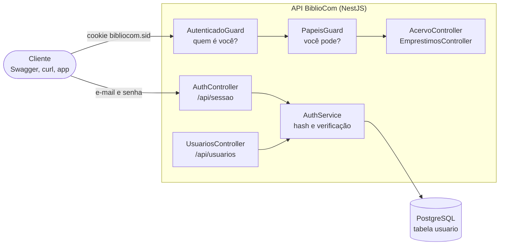
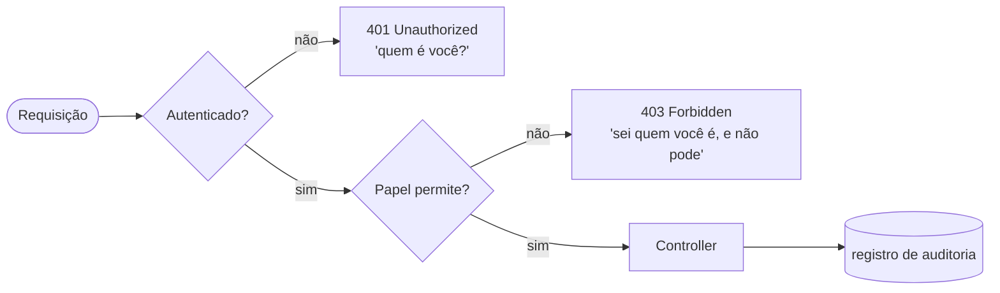
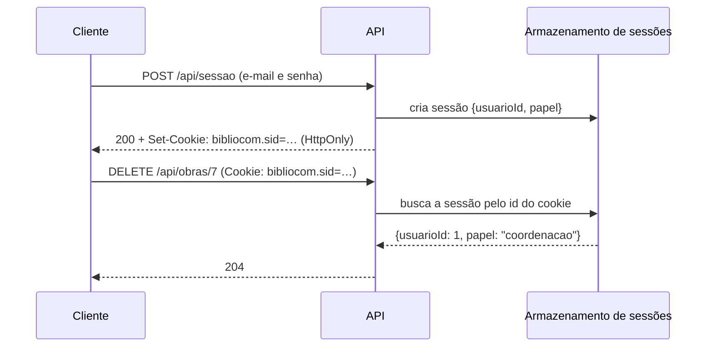

# M08 — Autenticação e autorização na API

> **Pré-requisitos:** M05, M07 · **Duração:** longa
> **Ementa:** gestão de usuários

Até o M07, qualquer pessoa com um `curl` apaga o acervo inteiro. Este módulo fecha a porta:
a API passa a saber **quem** está fazendo cada requisição e **o que** essa pessoa pode fazer —
sem confiar em nenhum cliente para decidir isso.

> **A teoria não está num bloco separado.** Ela está nas etapas 1, 3, 6 e 13 — em que a
> gente para de digitar e pensa — mais as explicações dentro de cada etapa.

## 🎯 Objetivos

Ao final você será capaz de:

1. Diferenciar autenticação, autorização e auditoria.
2. Modelar usuário, senha armazenada com hash e papéis.
3. Implementar login e sessão com expiração, em cookie `HttpOnly`.
4. Proteger rotas com guards e autorizar operações por papel.
5. Responder `401` e `403` nos casos certos, e documentá-los no Swagger.

---

## 🧭 Por que este módulo chega agora

O M08 não é uma aula de "login no final do curso". Ele aparece neste ponto porque o sistema
já tem estrutura, dados e endpoints suficientes para **precisar** de identidade real.

Até aqui, a turma construiu a API e modelou o domínio. Agora o problema deixa de ser apenas
"como a aplicação funciona" e passa a ser "quem pode fazer o quê". A partir desse momento, o
backend precisa distinguir usuário, ação e permissão — e não pode mais confiar numa ideia
genérica de "quem acessou o site".

> Quando você chega ao M08, já tem uma aplicação funcional. O que muda agora é o nível de
> maturidade: a aplicação deixa de ser acessível a qualquer um e passa a ser governada por
> regra de acesso.

## 🧭 O que você vai construir

Um módulo `auth` com a entidade `Usuario`, login por sessão, dois guards e dois papéis. No
fim, esta é a matriz de acesso do BiblioCom, **garantida pelo servidor**:

| Rota | Anônimo | Bibliotecário | Coordenação |
|---|:---:|:---:|:---:|
| `GET /api/obras` e `GET /api/obras/:id` | ✅ | ✅ | ✅ |
| `POST /api/obras`, `PATCH /api/obras/:id` | 401 | ✅ | ✅ |
| `DELETE /api/obras/:id` | 401 | 403 | ✅ |
| `POST /api/emprestimos` | 401 | ✅ | ✅ |
| `POST /api/usuarios` | 401 | 403 | ✅ |



## 📋 Como este módulo funciona

Mesmo formato dos anteriores.

| Parte | O que é |
|---|---|
| **Faça** | O comando ou o código, para digitar |
| **Linha a linha** | Uma tabela explicando **cada elemento** |
| **Rode** | Como verificar |
| **Deu certo se** | O resultado exato esperado |

> 🪟 Os comandos usam `curl.exe` no PowerShell 5.1. No macOS, no Linux e no PowerShell 7,
> troque por `curl` e tire as barras de dentro do JSON: `-d '{"email":"…"}'`.

### As quinze etapas

| # | Etapa | Duração | O que entra |
|---|---|---|---|
| 1 | [**Três perguntas diferentes**](#etapa-1--três-perguntas-diferentes) | média | **autenticação, autorização, auditoria** |
| 2 | [A entidade `Usuario`](#etapa-2--a-entidade-usuario) | média | `select: false`, papel, migração |
| 3 | [**Por que hash, e não criptografia**](#etapa-3--por-que-hash-e-não-criptografia) | média | **hash lento, sal** |
| 4 | [Guardar e conferir a senha](#etapa-4--guardar-e-conferir-a-senha) | média | Argon2, mensagem genérica |
| 5 | [O primeiro usuário](#etapa-5--o-primeiro-usuário) | curta | script de *seed* |
| 6 | [**Sessão ou token**](#etapa-6--sessão-ou-token) | média | **a decisão do módulo** |
| 7 | [Ligar a sessão](#etapa-7--ligar-a-sessão) | média | `express-session`, cookie `HttpOnly` |
| 8 | [O login](#etapa-8--o-login) | média | `POST /api/sessao`, `regenerate` |
| 9 | [O guard de autenticação](#etapa-9--o-guard-de-autenticação) | média | `CanActivate`, `401` |
| 10 | [Quem sou eu, e sair](#etapa-10--quem-sou-eu-e-sair) | curta | decorator de parâmetro, logout |
| 11 | [Papéis](#etapa-11--papéis) | média | `SetMetadata`, `Reflector`, `403` |
| 12 | [Cadastro administrativo](#etapa-12--cadastro-administrativo) | média | rota só da coordenação |
| 13 | [**`401` ou `403`**](#etapa-13--401-ou-403) | curta | **a matriz na prática** |
| 14 | [O Swagger com login](#etapa-14--o-swagger-com-login) | curta | `addCookieAuth` |
| 15 | [Registrar a decisão](#etapa-15--registrar-a-decisão) | curta | ADR |

---

## Etapa 1 — Três perguntas diferentes

Pense na **portaria de um prédio comercial**:

| Na portaria | Na API | A pergunta |
|---|---|---|
| Você mostra o documento e recebe um **crachá** | **Autenticação** | *Quem é você?* |
| A **catraca** de cada andar libera ou não o seu crachá | **Autorização** | *Você pode fazer isto?* |
| O **livro de registro** anota quem entrou, quando e onde | **Auditoria** | *Quem fez o quê?* |

São três mecanismos diferentes, e confundi-los é a origem dos erros mais caros deste
assunto. Um crachá válido não abre todos os andares; e uma catraca que só confere "tem
crachá?" deixa o estagiário entrar na sala do cofre.

Na API, cada requisição passa pelas duas primeiras perguntas **antes** de chegar ao
controller:



> ⚠️ **O nome do status 401 engana.** Ele se chama *Unauthorized*, mas significa **não
> autenticado**. O "não autorizado" de verdade é o **403**. A etapa 13 volta a isso.

💼 **No mercado:** "qual a diferença entre 401 e 403?" é pergunta de triagem em entrevista de
backend. E *Broken Access Control* é o primeiro item do OWASP Top 10 — o M09 começa por ele.

---

## Etapa 2 — A entidade `Usuario`

**Faça** — o módulo, pela CLI, um comando de cada vez:

```powershell
nest generate module auth
```

```powershell
nest generate service auth --no-spec
```

```powershell
nest generate controller auth --no-spec
```

**Faça:** crie `src\auth\usuario.entity.ts`:

```ts
import { Column, CreateDateColumn, Entity, PrimaryGeneratedColumn } from "typeorm";

export enum Papel {
  BIBLIOTECARIO = "bibliotecario",
  COORDENACAO = "coordenacao",
}

@Entity()
export class Usuario {
  @PrimaryGeneratedColumn()
  id: number;

  @Column({ length: 150 })
  nome: string;

  @Column({ length: 200, unique: true })
  email: string;

  @Column({ select: false })
  senhaHash: string;

  @Column({ type: "enum", enum: Papel, default: Papel.BIBLIOTECARIO })
  papel: Papel;

  @Column({ type: "boolean", default: true })
  ativo: boolean;

  @CreateDateColumn()
  criadoEm: Date;
}
```

**Linha a linha:**

| Trecho | Por quê |
|---|---|
| `enum Papel` | O conjunto de papéis é fechado. Texto livre deixaria `"Coordenacao"` e `"coordenação"` virarem papéis diferentes |
| `email` com `unique` | É o que a pessoa digita para entrar. Dois usuários com o mesmo e-mail tornariam o login ambíguo |
| `senhaHash`, não `senha` | O nome já avisa: aqui **nunca** mora a senha, só o resultado do hash (etapa 3) |
| `select: false` | Todo `find` deixa esta coluna de fora. Para lê-la, é preciso pedir explicitamente — e só o login pede |
| `default: Papel.BIBLIOTECARIO` | O papel com **menos** poder é o padrão. Esquecer de informar o papel nunca promove ninguém |
| `ativo` | Desligar alguém sem apagar o histórico. Apagar o usuário quebraria a auditoria de quem fez o quê |

**Faça:** registre no `src\auth\auth.module.ts`:

```ts
import { TypeOrmModule } from "@nestjs/typeorm";
import { Usuario } from "./usuario.entity.js";

@Module({
  imports: [TypeOrmModule.forFeature([Usuario])],
  controllers: [AuthController],
  providers: [AuthService],
})
export class AuthModule {}
```

**Faça:** o ciclo do M05 — gerar, **ler**, aplicar:

```powershell
npm run migration:generate src/migracoes/CriaUsuario
```

**Rode:** abra o arquivo antes de aplicar. Ele deve criar o tipo `usuario_papel_enum` e a
tabela `usuario`, com a restrição `UNIQUE ("email")`.

```powershell
npm run migration:run
```

**Deu certo se:**

```powershell
docker compose exec db psql -U bibliocom -d bibliocom -c "\d usuario"
```

mostra as sete colunas e, no rodapé, a restrição única em `email`.

---

## Etapa 3 — Por que hash, e não criptografia

Se o banco vazar — e bancos vazam —, o que o atacante leva?

| Como a senha foi guardada | O que o vazamento entrega |
|---|---|
| Texto puro | Todas as senhas, prontas para usar aqui e em qualquer outro site onde a pessoa repetiu a senha |
| Criptografada | Todas as senhas, assim que alguém achar a chave — que costuma estar no mesmo servidor |
| **Hash lento, com sal** | Um trabalho enorme por senha, e nenhuma senha de graça |

**Hash é um moedor de carne:** dá para moer, e não dá para "desmoer". A partir da senha
sai sempre a mesma massa, e a partir da massa não se reconstrói a senha. No login, a API não
compara senhas: ela mói o que a pessoa digitou e compara **as massas**.

Criptografia é um cofre: quem tem a chave abre. Senha não precisa de cofre, porque a API
**nunca** precisa ler a senha de volta.

Dois detalhes fazem a diferença entre um hash bom e um ruim:

| Detalhe | O problema que resolve |
|---|---|
| **Sal** — um valor aleatório misturado a cada senha | Sem sal, duas pessoas com a senha `123456` têm o mesmo hash, e uma tabela pronta de hashes de senhas comuns quebra todas de uma vez |
| **Lentidão proposital** | Um hash rápido (MD5, SHA-256) deixa o atacante testar bilhões de senhas por segundo. O Argon2 é feito para ser caro — em tempo **e** em memória |

> ⚠️ **SHA-256 não é hash de senha.** É um ótimo hash para verificar arquivos, justamente
> porque é rápido. Para senha, rapidez é defeito.

---

## Etapa 4 — Guardar e conferir a senha

**Faça:**

```powershell
npm install argon2
```

> O pacote traz o programa já compilado para Windows x64, Linux e macOS com chip Apple — não
> precisa de compilador instalado. O npm 11 pode avisar `install scripts not yet covered by
> allowScripts` citando o `argon2`: é esperado. O script que ele pulou só serviria para
> compilar, e o binário pronto já está no pacote.

**Faça:** em `src\auth\auth.service.ts`:

```ts
import { ConflictException, Injectable, UnauthorizedException } from "@nestjs/common";
import { InjectRepository } from "@nestjs/typeorm";
import * as argon2 from "argon2";
import { Repository } from "typeorm";
import { Papel, Usuario } from "./usuario.entity.js";

@Injectable()
export class AuthService {
  constructor(@InjectRepository(Usuario) private readonly usuarios: Repository<Usuario>) {}

  async criar(nome: string, email: string, senha: string, papel: Papel): Promise<Usuario> {
    if (await this.usuarios.existsBy({ email })) {
      throw new ConflictException("Já existe usuário com este e-mail");
    }
    const senhaHash = await argon2.hash(senha);
    return this.usuarios.save(this.usuarios.create({ nome, email, senhaHash, papel }));
  }

  async validar(email: string, senha: string): Promise<Usuario> {
    const usuario = await this.usuarios.findOne({
      where: { email, ativo: true },
      select: { id: true, nome: true, email: true, papel: true, senhaHash: true },
    });
    const senhaConfere = usuario ? await argon2.verify(usuario.senhaHash, senha) : false;
    if (!usuario || !senhaConfere) {
      throw new UnauthorizedException("E-mail ou senha inválidos");
    }
    return usuario;
  }

  buscar(id: number): Promise<Usuario | null> {
    return this.usuarios.findOneBy({ id, ativo: true });
  }
}
```

**Linha a linha:**

| Trecho | O que faz |
|---|---|
| `argon2.hash(senha)` | Gera o sal, mói a senha e devolve **um texto só** com tudo dentro: algoritmo, parâmetros, sal e hash |
| `existsBy({ email })` | Recusa e-mail repetido com `409` antes de tentar gravar. A restrição `unique` do banco continua lá como última barreira |
| `select: { …, senhaHash: true }` | Pede **explicitamente** a coluna que o `select: false` esconde. É o único lugar do sistema que a lê |
| `where: { email, ativo: true }` | Usuário desativado não entra, mesmo com a senha certa |
| `argon2.verify(hash, senha)` | Lê o sal e os parâmetros de dentro do hash, mói a senha digitada do mesmo jeito e compara |
| **Uma mensagem só** para os dois erros | "E-mail não existe" e "senha errada" respondem igual. Mensagens diferentes ensinariam ao atacante quais e-mails estão cadastrados |

> **Por que o `validar` recebe e-mail e senha, e não um DTO?** Porque o service não sabe de
> HTTP. Quem converte o corpo da requisição em DTO é o controller (M07); o service trabalha
> com valores. É isso que vai permitir testá-lo sem servidor no M10.

**Deu certo se:** o projeto compila sem erro (`npm run build`). Ainda não há rota que chame
estes métodos.

---

## Etapa 5 — O primeiro usuário

Problema de ovo e galinha: para criar usuários pela API, é preciso estar logado como
coordenação; e para estar logado, é preciso existir um usuário. A saída é um **script** que
cria o primeiro, direto no banco.

**Faça:** em `backend\.env`, acrescente (só em desenvolvimento):

```ini
ADMIN_EMAIL=coordenacao@bibliocom.org
ADMIN_SENHA=troque-esta-senha-longa
```

**Faça:** crie `src\seed-admin.ts`:

```ts
import "dotenv/config";
import * as argon2 from "argon2";
import fonte from "./data-source.js";

const email = process.env.ADMIN_EMAIL;
const senha = process.env.ADMIN_SENHA;
if (!email || !senha || senha.length < 12) {
  console.error("Defina ADMIN_EMAIL e ADMIN_SENHA (mínimo de 12 caracteres)");
  process.exit(1);
}

await fonte.initialize();
await fonte.query(
  `INSERT INTO "usuario" ("nome", "email", "senhaHash", "papel")
   VALUES ($1, $2, $3, 'coordenacao')
   ON CONFLICT ("email") DO NOTHING`,
  ["Coordenação", email, await argon2.hash(senha)],
);
await fonte.destroy();
console.log(`Usuário de coordenação pronto: ${email}`);
```

**Linha a linha:**

| Trecho | O que faz |
|---|---|
| `import fonte from "./data-source.js"` | Reaproveita o `DataSource` do M05. É por isso que ele foi escrito para funcionar também compilado |
| `$1, $2, $3` | Parâmetros, nunca concatenação — a regra do M06 vale também para script |
| `ON CONFLICT ("email") DO NOTHING` | Rodar duas vezes não duplica nem dá erro. Script que pode rodar de novo sem estrago se chama **idempotente** |
| `senha.length < 12` | A mesma política da API (etapa 12). O primeiro usuário é o mais poderoso: não merece senha fraca |

**Faça:** o atalho no `package.json`:

```json
"seed:admin": "node dist/seed-admin.js"
```

**Rode:**

```powershell
npm run build
```

```powershell
npm run seed:admin
```

**Deu certo se:** aparece `Usuário de coordenação pronto`, e:

```powershell
docker compose exec db psql -U bibliocom -d bibliocom -c "SELECT email, papel, left(""senhaHash"", 30) FROM usuario;"
```

mostra um hash começando por `$argon2id$v=19$m=65536`. Rode o `seed:admin` de novo: nada
muda.

> O M12 roda este mesmo script em produção, com `ADMIN_EMAIL` e `ADMIN_SENHA` definidos no
> painel da plataforma — nunca no Git.

---

## Etapa 6 — Sessão ou token

Depois do login, a pessoa não pode mandar e-mail e senha a cada requisição. Ela recebe
**algo** que prova que já se identificou. Há dois jeitos clássicos:

| | **Sessão** | **Token (JWT)** |
|---|---|---|
| Analogia | A **comanda** de um restaurante: um número; a conta fica no caixa | A **pulseira** de um show: os dados estão nela, com um selo difícil de falsificar |
| Onde ficam os dados | No servidor. O cliente guarda só um identificador | No próprio token, assinado pelo servidor |
| Como viaja | Cookie, que o navegador envia sozinho | Cabeçalho `Authorization: Bearer …`, que o cliente envia à mão |
| Logout | O servidor apaga a sessão: efeito imediato | O token vale até expirar. Revogar exige lista de bloqueio |
| Ponto fraco | Precisa de armazenamento no servidor; cookie exige cuidado com CSRF (M09) | Roubou o token, roubou a identidade até ele expirar |



**A decisão deste curso: sessão em cookie `HttpOnly`.** Os motivos, na ordem:

1. O logout funciona de verdade — requisito comum em sistema de biblioteca com computador
   compartilhado no balcão.
2. O cookie `HttpOnly` não pode ser lido por JavaScript: um script malicioso na página não
   consegue roubá-lo (M09).
3. O Swagger, o navegador e o `curl` enviam o cookie sem código extra.

Token é a escolha certa em outros cenários — aplicativo móvel, integração entre sistemas,
muitos servidores sem armazenamento compartilhado. **O que não é aceitável é escolher sem
saber por quê.** A etapa 15 transforma esta tabela num registro de decisão.

---

## Etapa 7 — Ligar a sessão

**Faça:**

```powershell
npm install express-session
```

```powershell
npm install -D @types/express-session
```

**Faça:** gere um segredo aleatório:

```powershell
node -e "console.log(require('crypto').randomBytes(32).toString('hex'))"
```

e acrescente ao `backend\.env`:

```ini
SESSION_SECRET=<cole aqui os 64 caracteres gerados>
```

**Faça:** acrescente ao esquema de validação, em `src\config\esquema-env.ts`:

```ts
SESSION_SECRET: z
  .string("SESSION_SECRET é obrigatória")
  .min(32, "SESSION_SECRET precisa de pelo menos 32 caracteres"),
```

> ⚠️ **Não pule este passo.** Lembra do M04? O `validate` do `ConfigModule` só repassa ao
> `process.env` as chaves que estão no esquema. Sem esta linha, o `SESSION_SECRET` some — e o
> erro aparece longe daqui: `secret option required for sessions`.

**Faça:** em `src\main.ts`, ao lado do `useGlobalPipes`:

```ts
import session from "express-session";

app.use(
  session({
    name: "bibliocom.sid",
    secret: process.env.SESSION_SECRET!,
    resave: false,
    saveUninitialized: false,
    cookie: {
      httpOnly: true,
      sameSite: "lax",
      secure: process.env.NODE_ENV === "production",
      maxAge: 8 * 60 * 60 * 1000,
    },
  }),
);
```

**Linha a linha:**

| Trecho | O que faz |
|---|---|
| `app.use(session(…))` | Um *middleware* do Express: roda em toda requisição, antes dos guards, e pendura a sessão em `req.session` |
| `name: "bibliocom.sid"` | O nome do cookie. O padrão, `connect.sid`, anuncia qual biblioteca você usa |
| `secret` | Assina o cookie. Sem conhecer o segredo, ninguém fabrica um cookie válido |
| `!` depois do `SESSION_SECRET` | Diz ao TypeScript "confie, não é `undefined`". Pode confiar porque o esquema do `ConfigModule` barra a subida sem ele |
| `resave: false` | Não regrava a sessão a cada requisição se nada mudou |
| `saveUninitialized: false` | Não cria sessão para quem só está visitando. Sessão nasce no login |
| `httpOnly: true` | JavaScript da página **não** lê o cookie. É o que protege contra roubo por XSS (M09) |
| `sameSite: "lax"` | O navegador não envia o cookie em requisições de escrita vindas de outro site. Primeira linha de defesa contra CSRF (M09) |
| `secure` só em produção | Cookie `secure` só viaja em HTTPS. Em `localhost` não há HTTPS, então ligá-lo aqui impediria o login |
| `maxAge` | Oito horas: um turno de trabalho. Depois disso, login de novo |

**Faça:** ensine ao TypeScript o que vai dentro da sessão. Crie `src\auth\sessao.d.ts`:

```ts
import "express-session";
import { Papel } from "./usuario.entity.js";

declare module "express-session" {
  interface SessionData {
    usuarioId: number;
    papel: Papel;
  }
}
```

| Trecho | O que faz |
|---|---|
| `.d.ts` | Arquivo só de tipos: não gera JavaScript nenhum |
| `declare module "express-session"` | **Acrescenta** campos a um tipo que vem da biblioteca, sem editá-la |
| `SessionData` | O formato de `req.session`. Sem isto, `req.session.usuarioId` seria erro de compilação |

> A sessão fica, por enquanto, **na memória do processo**: reiniciou a API, todo mundo
> precisa entrar de novo. Para desenvolvimento, é aceitável. No M12, as sessões passam a
> morar no PostgreSQL.

**Deu certo se:** a API sobe sem erro. Nada mudou para quem chama — ainda não há login.

---

## Etapa 8 — O login

**Faça:** crie `src\auth\login.dto.ts`:

```ts
import { ApiProperty } from "@nestjs/swagger";
import { IsEmail, IsString, Length } from "class-validator";

export class LoginDto {
  @ApiProperty({ example: "coordenacao@bibliocom.org" })
  @IsEmail()
  email: string;

  @ApiProperty({ example: "troque-esta-senha-longa" })
  @IsString()
  @Length(1, 200)
  senha: string;
}
```

**Faça:** substitua o conteúdo de `src\auth\auth.controller.ts`:

```ts
import { Body, Controller, HttpCode, Post, Req } from "@nestjs/common";
import { ApiTags, ApiUnauthorizedResponse } from "@nestjs/swagger";
import type { Request } from "express";
import { AuthService } from "./auth.service.js";
import { LoginDto } from "./login.dto.js";

@ApiTags("sessao")
@Controller("sessao")
export class AuthController {
  constructor(private readonly auth: AuthService) {}

  @Post()
  @HttpCode(200)
  @ApiUnauthorizedResponse({ description: "E-mail ou senha inválidos" })
  async entrar(@Body() dto: LoginDto, @Req() req: Request) {
    const usuario = await this.auth.validar(dto.email, dto.senha);
    await new Promise<void>((ok, falha) => req.session.regenerate((e) => (e ? falha(e) : ok())));
    req.session.usuarioId = usuario.id;
    req.session.papel = usuario.papel;
    return { id: usuario.id, nome: usuario.nome, papel: usuario.papel };
  }
}
```

**Linha a linha:**

| Trecho | O que faz |
|---|---|
| `@Controller("sessao")` | O recurso é a **sessão** (M07: rota é substantivo). Entrar cria uma; sair apaga |
| `@HttpCode(200)` | O `POST` do Nest responde 201 por padrão. Aqui não se cria um recurso consultável depois, então 200 |
| `@Req() req: Request` | Acesso ao objeto da requisição do Express, onde o middleware pendurou a `session` |
| `import type { Request }` | Só o tipo é usado. O `type` evita importar o Express em tempo de execução à toa |
| `req.session.regenerate(…)` | **Troca o identificador da sessão** no momento do login. Veja o quadro abaixo |
| `new Promise(…)` | O `regenerate` avisa que terminou por *callback*, o estilo antigo. A `Promise` o transforma em algo que dá para `await` |
| `usuarioId` e `papel` na sessão | É tudo que os guards vão precisar. A senha, claro, não vai |
| O `return` | Só o necessário para a tela dizer "olá, Coordenação". Nada de e-mail, nada de hash |

> **Por que regenerar: trocar a fechadura quando muda o morador.** Se o identificador da
> sessão fosse o mesmo antes e depois do login, um atacante poderia plantar um identificador
> conhecido no navegador da vítima e esperar ela entrar — é o ataque de *session fixation*.
> Regenerar no login invalida qualquer identificador anterior.

**Rode** — primeiro, a senha errada:

```powershell
curl.exe -s -i -X POST http://localhost:3000/api/sessao -H "Content-Type: application/json" -d '{\"email\":\"coordenacao@bibliocom.org\",\"senha\":\"errada\"}'
```

**Deu certo se:** `401` com `"E-mail ou senha inválidos"`. Troque o e-mail por um que não
existe: a resposta é **idêntica**.

**Rode** — agora a certa, guardando o cookie num arquivo:

```powershell
curl.exe -s -i -c cookies.txt -X POST http://localhost:3000/api/sessao -H "Content-Type: application/json" -d '{\"email\":\"coordenacao@bibliocom.org\",\"senha\":\"troque-esta-senha-longa\"}'
```

| Trecho | O que faz |
|---|---|
| `-c cookies.txt` | Grava os cookies recebidos num arquivo — o "pote de biscoitos" do `curl` |
| `-i` | Mostra os cabeçalhos, para você ver o `Set-Cookie` |

**Deu certo se:** `200`, o corpo com `"papel":"coordenacao"` e um cabeçalho assim:

```
Set-Cookie: bibliocom.sid=s%3ADJH4…; Path=/; Expires=…; HttpOnly; SameSite=Lax
```

> O `cookies.txt` é uma credencial: quem tem o arquivo está logado. Ele já está fora do Git?
> Acrescente `cookies.txt` ao `.gitignore`.

---

## Etapa 9 — O guard de autenticação

Um **guard** é a catraca da etapa 1: uma classe que o Nest consulta **antes** do método do
controller, e que responde uma pergunta só — *deixo passar?*

**Faça:** crie `src\auth\autenticado.guard.ts`:

```ts
import { CanActivate, ExecutionContext, Injectable, UnauthorizedException } from "@nestjs/common";
import type { Request } from "express";

@Injectable()
export class AutenticadoGuard implements CanActivate {
  canActivate(contexto: ExecutionContext): boolean {
    const req = contexto.switchToHttp().getRequest<Request>();
    if (!req.session.usuarioId) {
      throw new UnauthorizedException("Faça login para continuar");
    }
    return true;
  }
}
```

**Linha a linha:**

| Trecho | O que faz |
|---|---|
| `implements CanActivate` | O contrato de todo guard: um método `canActivate` que devolve verdadeiro ou falso |
| `ExecutionContext` | O "envelope" da requisição. O Nest também atende WebSocket e microsserviços, por isso o `switchToHttp()` |
| `req.session.usuarioId` | Só existe se o login da etapa 8 aconteceu **nesta sessão** |
| `throw new UnauthorizedException` | Em vez de `return false` (que daria um 403 genérico), lança o 401 com mensagem útil |

**Faça:** proteja as rotas de escrita do `AcervoController`:

```ts
import { UseGuards } from "@nestjs/common";
import { AutenticadoGuard } from "../auth/autenticado.guard.js";

  @Post()
  @UseGuards(AutenticadoGuard)
  @HttpCode(201)
  // …o resto do método igual
```

Faça o mesmo no `@Patch(":id")` e no `@Delete(":id")`. No `EmprestimosController`, ponha o
`@UseGuards(AutenticadoGuard)` **em cima da classe**: vale para todas as rotas dela.

**Rode** — sem o cookie:

```powershell
curl.exe -s -X POST http://localhost:3000/api/obras -H "Content-Type: application/json" -d '{\"titulo\":\"Quincas Borba\",\"autorId\":1}'
```

**Deu certo se:** `{"message":"Faça login para continuar","error":"Unauthorized","statusCode":401}`.

**Rode** — com o cookie (`-b` **envia** o que o `-c` gravou):

```powershell
curl.exe -s -b cookies.txt -X POST http://localhost:3000/api/obras -H "Content-Type: application/json" -d '{\"titulo\":\"Quincas Borba\",\"autorId\":1}'
```

**Deu certo se:** a obra é criada. E o `GET /api/obras`, sem cookie nenhum, continua
funcionando: o catálogo é público.

---

## Etapa 10 — Quem sou eu, e sair

**Faça:** um decorator que entrega o id do usuário logado direto no parâmetro. Crie
`src\auth\usuario-atual.decorator.ts`:

```ts
import { createParamDecorator, ExecutionContext } from "@nestjs/common";
import type { Request } from "express";

export const UsuarioAtual = createParamDecorator((_dado: unknown, contexto: ExecutionContext) => {
  const req = contexto.switchToHttp().getRequest<Request>();
  return req.session.usuarioId;
});
```

| Trecho | O que faz |
|---|---|
| `createParamDecorator` | Cria um decorator como o `@Body()` ou o `@Param()`, só que seu |
| `_dado` | O que viria entre parênteses, como em `@Param("id")`. Não usamos; o `_` avisa que é de propósito |

**Faça:** mais duas rotas no `AuthController`:

```ts
import { Delete, Get, UseGuards } from "@nestjs/common";
import { ApiCookieAuth } from "@nestjs/swagger";
import { AutenticadoGuard } from "./autenticado.guard.js";
import { UsuarioAtual } from "./usuario-atual.decorator.js";

  @Get()
  @UseGuards(AutenticadoGuard)
  @ApiCookieAuth()
  async quemSou(@UsuarioAtual() usuarioId: number) {
    const usuario = await this.auth.buscar(usuarioId);
    return usuario && { id: usuario.id, nome: usuario.nome, papel: usuario.papel };
  }

  @Delete()
  @HttpCode(204)
  async sair(@Req() req: Request) {
    await new Promise<void>((ok, falha) => req.session.destroy((e) => (e ? falha(e) : ok())));
  }
```

**Rode:**

```powershell
curl.exe -s -b cookies.txt http://localhost:3000/api/sessao
```

```powershell
curl.exe -s -i -b cookies.txt -X DELETE http://localhost:3000/api/sessao
```

```powershell
curl.exe -s -b cookies.txt http://localhost:3000/api/sessao
```

**Deu certo se:** o primeiro devolve a coordenação; o segundo, `204`; e o terceiro, `401` —
**com o mesmo `cookies.txt` de antes**. O cookie continua no arquivo, mas a sessão a que ele
apontava foi destruída no servidor. É a vantagem da comanda da etapa 6: rasgada a conta no
caixa, o papelzinho na mão do cliente não vale mais nada.

Faça login de novo antes de seguir.

---

## Etapa 11 — Papéis

Autenticado não é o mesmo que autorizado. Um bibliotecário pode cadastrar obra, e **não**
pode apagar o acervo.

**Faça:** um decorator que **anota** os papéis exigidos. Crie `src\auth\papeis.decorator.ts`:

```ts
import { SetMetadata } from "@nestjs/common";
import { Papel } from "./usuario.entity.js";

export const CHAVE_PAPEIS = "papeis";
export const Papeis = (...papeis: Papel[]) => SetMetadata(CHAVE_PAPEIS, papeis);
```

**Faça:** e o guard que **lê** a anotação. Crie `src\auth\papeis.guard.ts`:

```ts
import { CanActivate, ExecutionContext, ForbiddenException, Injectable } from "@nestjs/common";
import { Reflector } from "@nestjs/core";
import type { Request } from "express";
import { CHAVE_PAPEIS } from "./papeis.decorator.js";
import { Papel } from "./usuario.entity.js";

@Injectable()
export class PapeisGuard implements CanActivate {
  constructor(private readonly reflector: Reflector) {}

  canActivate(contexto: ExecutionContext): boolean {
    const exigidos = this.reflector.getAllAndOverride<Papel[]>(CHAVE_PAPEIS, [
      contexto.getHandler(),
      contexto.getClass(),
    ]);
    if (!exigidos) return true;

    const req = contexto.switchToHttp().getRequest<Request>();
    if (!req.session.papel || !exigidos.includes(req.session.papel)) {
      throw new ForbiddenException("Seu papel não permite esta ação");
    }
    return true;
  }
}
```

**Linha a linha:**

| Trecho | O que faz |
|---|---|
| `SetMetadata(CHAVE, valor)` | Cola uma etiqueta no método. Sozinha, ela não faz nada — é um bilhete para quem ler |
| `...papeis` | Aceita quantos papéis você quiser: `@Papeis(A)` ou `@Papeis(A, B)` |
| `Reflector` | O leitor de etiquetas do Nest. Chega pelo construtor, como qualquer dependência (M03) |
| `getAllAndOverride(…, [handler, classe])` | Procura a etiqueta primeiro no **método**, depois na **classe**. A do método vence |
| `if (!exigidos) return true` | Rota sem `@Papeis` não exige papel nenhum — basta estar autenticado |
| `ForbiddenException` | **403**: "sei quem você é, e mesmo assim não pode" |

**Faça:** aplique no `AcervoController`. Os dois guards, **nesta ordem**:

```ts
import { Papeis } from "../auth/papeis.decorator.js";
import { PapeisGuard } from "../auth/papeis.guard.js";
import { Papel } from "../auth/usuario.entity.js";

  @Post()
  @UseGuards(AutenticadoGuard, PapeisGuard)
  @Papeis(Papel.BIBLIOTECARIO, Papel.COORDENACAO)
  // …

  @Delete(":id")
  @UseGuards(AutenticadoGuard, PapeisGuard)
  @Papeis(Papel.COORDENACAO)
  // …
```

O `@Patch(":id")` fica igual ao `@Post()`.

> **A ordem importa.** Os guards rodam da esquerda para a direita. Primeiro "quem é você?"
> (401), depois "você pode?" (403). Invertidos, um anônimo receberia 403 — dizendo que ele
> "não tem permissão" quando, na verdade, ninguém sabe quem ele é.

**Deu certo se:** logado como coordenação, o `DELETE` de uma obra responde `204`. O teste
com o bibliotecário vem na próxima etapa, quando você tiver como criá-lo.

---

## Etapa 12 — Cadastro administrativo

**Faça:** o DTO. Crie `src\auth\criar-usuario.dto.ts`:

```ts
import { ApiProperty } from "@nestjs/swagger";
import { IsEmail, IsEnum, IsString, Length } from "class-validator";
import { Papel } from "./usuario.entity.js";

export class CriarUsuarioDto {
  @ApiProperty({ example: "Caio Lima" })
  @IsString()
  @Length(1, 150)
  nome: string;

  @ApiProperty({ example: "caio@bibliocom.org" })
  @IsEmail()
  email: string;

  @ApiProperty({ minLength: 12, example: "uma frase longa como senha" })
  @IsString()
  @Length(12, 200)
  senha: string;

  @ApiProperty({ enum: Papel })
  @IsEnum(Papel)
  papel: Papel;
}
```

**Faça:** o controller. Crie `src\auth\usuarios.controller.ts`:

```ts
import { Body, Controller, HttpCode, Post, UseGuards } from "@nestjs/common";
import { ApiCookieAuth, ApiTags } from "@nestjs/swagger";
import { AuthService } from "./auth.service.js";
import { AutenticadoGuard } from "./autenticado.guard.js";
import { CriarUsuarioDto } from "./criar-usuario.dto.js";
import { Papeis } from "./papeis.decorator.js";
import { PapeisGuard } from "./papeis.guard.js";
import { Papel } from "./usuario.entity.js";

@ApiTags("usuarios")
@ApiCookieAuth()
@UseGuards(AutenticadoGuard, PapeisGuard)
@Papeis(Papel.COORDENACAO)
@Controller("usuarios")
export class UsuariosController {
  constructor(private readonly auth: AuthService) {}

  @Post()
  @HttpCode(201)
  async criar(@Body() dto: CriarUsuarioDto) {
    const usuario = await this.auth.criar(dto.nome, dto.email, dto.senha, dto.papel);
    return { id: usuario.id, nome: usuario.nome, email: usuario.email, papel: usuario.papel };
  }
}
```

E registre-o no `AuthModule`: `controllers: [AuthController, UsuariosController]`. Criado à
mão, ninguém o registra por você (M03, etapa 13).

| Trecho | Por quê |
|---|---|
| Guards e `@Papeis` **na classe** | Toda rota de gestão de usuários é da coordenação. Uma rota nova herda a proteção — esquecer não abre brecha |
| `@Length(12, 200)` na senha | Comprimento vale mais que complexidade: uma frase longa é mais forte e mais fácil de lembrar que `S3nh@!` |
| O `return` escolhido à mão | O DTO de saída do M07, na forma mais curta. O hash nunca sai da API |

**Rode** — como coordenação, crie um bibliotecário:

```powershell
curl.exe -s -b cookies.txt -X POST http://localhost:3000/api/usuarios -H "Content-Type: application/json" -d '{\"nome\":\"Caio Lima\",\"email\":\"caio@bibliocom.org\",\"senha\":\"outra-senha-bem-longa\",\"papel\":\"bibliotecario\"}'
```

**Deu certo se:** `201` com os dados do Caio, sem senha nem hash. Rode de novo: `409`. Com
`"senha":"curta"`: `400`.

**Rode** — entre como o Caio, num **outro** arquivo de cookies, e tente apagar uma obra:

```powershell
curl.exe -s -c caio.txt -X POST http://localhost:3000/api/sessao -H "Content-Type: application/json" -d '{\"email\":\"caio@bibliocom.org\",\"senha\":\"outra-senha-bem-longa\"}'
```

```powershell
curl.exe -s -b caio.txt -X DELETE http://localhost:3000/api/obras/1
```

**Deu certo se:** `{"message":"Seu papel não permite esta ação","error":"Forbidden","statusCode":403}`.

---

## Etapa 13 — `401` ou `403`

**Faça:** preencha a matriz do começo do módulo com o que a **sua** API responde — um
`curl.exe` por célula, com `-o NUL -w "%{http_code}"` para ver só o status:

```powershell
curl.exe -s -o NUL -w "%{http_code}`n" -b caio.txt -X DELETE http://localhost:3000/api/obras/1
```

| Trecho | O que faz |
|---|---|
| `-o NUL` | Joga o corpo fora (no Linux e no macOS, `-o /dev/null`) |
| ``-w "%{http_code}`n"`` | Imprime só o status e quebra a linha. A crase antes do `n` é a quebra de linha do PowerShell |

| Rota | Anônimo | Bibliotecário (`caio.txt`) | Coordenação (`cookies.txt`) |
|---|:---:|:---:|:---:|
| `GET /api/obras` | | | |
| `POST /api/obras` | | | |
| `DELETE /api/obras/:id` | | | |
| `POST /api/usuarios` | | | |

**Deu certo se:** a sua tabela bate com a da seção *O que você vai construir*.

| Situação | Status | Mensagem para quem chamou |
|---|---|---|
| Não mandou cookie, ou a sessão expirou | **401** | "Faça login" |
| Está logado, mas o papel não permite | **403** | "Você não pode" |
| Logado, com papel, mas o recurso não existe | **404** | "Não encontrado" |

> Guarde esta matriz: no M10 cada célula vira um teste automatizado, e ela passa a ser
> conferida a cada *pull request*, sem ninguém digitar `curl`.

---

## Etapa 14 — O Swagger com login

**Faça:** em `src\swagger.ts`, avise o documento de que existe login por cookie:

```ts
const config = new DocumentBuilder()
  .setTitle("BiblioCom API")
  .setDescription("Acervo de biblioteca comunitária")
  .setVersion("1.0")
  .addCookieAuth("bibliocom.sid")
  .build();
```

E marque as rotas protegidas do `AcervoController` com `@ApiCookieAuth()`, e as respostas de
erro com `@ApiUnauthorizedResponse()` e `@ApiForbiddenResponse()`, como o M07 fez com o 404.

**Rode:** abra <http://localhost:3000/api/docs>.

1. Em `POST /api/sessao`, **Try it out**, preencha e-mail e senha, **Execute**.
2. Em `DELETE /api/obras/{id}`, **Try it out**, **Execute**.

**Deu certo se:** o `DELETE` funciona sem você colar cookie nenhum. O Swagger roda no mesmo
endereço da API, então o navegador guardou o cookie do login e o enviou sozinho — o mesmo
que aconteceria com qualquer aplicação web na mesma origem.

---

## Etapa 15 — Registrar a decisão

A etapa 6 tomou uma decisão com consequências para o projeto inteiro. Decisão assim se
registra num **ADR** (*Architecture Decision Record*), para que quem chegar depois entenda o
porquê sem precisar perguntar.

**Faça:** crie `docs\adr\ADR-001-sessao-em-cookie.md` usando o
[modelo do projeto](../../projeto/modelos-de-documentos/adr.md). Ele precisa responder:

| Pergunta | A resposta deste módulo |
|---|---|
| Sessão ou token? | Sessão, e por quê (etapa 6) |
| Quanto tempo dura? | 8 horas (`maxAge`) |
| Como se revoga? | `DELETE /api/sessao` destrói a sessão no servidor |
| Onde ficam as sessões? | Memória em desenvolvimento; PostgreSQL em produção (M12) |
| Política de senha? | Mínimo de 12 caracteres, hash Argon2 |
| O que perdemos? | Por exemplo: um aplicativo móvel futuro exigiria outro mecanismo |

**Deu certo se:** alguém da equipe que não fez este módulo lê o ADR e consegue dizer, sem
perguntar, por que a API não usa JWT.

---

## 🤖 IA no fluxo

Peça a um assistente de IA "um login com NestJS" e é bem provável que venha um JWT com o
segredo escrito no código, uma senha comparada com `===` ou uma mensagem diferente para
"usuário não encontrado". Código de autenticação gerado por IA **parece** certo com
facilidade, porque o caminho feliz funciona.

Use o assistente para o que ele faz bem — gerar os casos de `curl` da matriz, explicar uma
mensagem de erro, revisar o seu código contra esta lista:

- [ ] A senha é guardada com hash lento (Argon2 ou bcrypt), nunca com SHA ou MD5?
- [ ] O segredo vem do ambiente e está no esquema de validação?
- [ ] E-mail inexistente e senha errada respondem igual?
- [ ] A autorização é decidida **no servidor**, rota a rota?
- [ ] Algum campo sensível sai na resposta?

Quem responde "sim" ou "não" a cada item, com o código na frente, é você.

## ⚠️ Erros comuns

| Sintoma | Diagnóstico |
|---|---|
| `secret option required for sessions` | O `SESSION_SECRET` não está no esquema do `ConfigModule` — etapa 7 |
| Login responde 200, mas a rota seguinte dá 401 | O `curl` não mandou o cookie: faltou `-b cookies.txt`. No navegador, o cookie pode ter sido recusado — veja a próxima linha |
| Login funciona local e não em produção | `secure: true` exige HTTPS, e a plataforma precisa do `trust proxy` (M12) |
| Todo mundo é deslogado quando a API reinicia | Sessões em memória. Esperado em desenvolvimento; em produção, PostgreSQL (M12) |
| `Property 'usuarioId' does not exist on type 'Session'` | Falta o `sessao.d.ts` — etapa 7 |
| Anônimo recebe 403 em vez de 401 | Guards na ordem errada: `AutenticadoGuard` primeiro — etapa 11 |
| A resposta traz `senhaHash` | Você devolveu a entidade. Monte a resposta à mão ou com DTO de saída |
| `Nest can't resolve dependencies of the UsuariosController` | O controller não foi registrado no `AuthModule` — etapa 12 |
| `npm install argon2` tenta compilar e falha | Seu sistema não tem binário pronto (Mac Intel, por exemplo). Instale as ferramentas de compilação ou use `bcrypt` |
| `Invalid email` no login com e-mail certo | O JSON chegou quebrado. No PowerShell 5.1, confira as `\"` dentro das aspas simples |

## 💣 Pegadinha de mercado

**Proteger a tela e esquecer a rota.** Esconder o botão "Excluir" de quem não é coordenação
não protege nada: o `DELETE` continua lá, e qualquer um com `curl` o chama. Toda decisão de
acesso mora no servidor, rota a rota. Interface que esconde botão é conforto para quem usa;
guard que devolve 403 é segurança.

## ✅ Checklist de saída

- [ ] Senhas nunca são armazenadas em texto puro: a tabela mostra hashes `$argon2id$`
- [ ] `senhaHash` com `select: false`, e nenhuma resposta da API a contém
- [ ] Login inválido responde igual para e-mail inexistente e senha errada
- [ ] O identificador da sessão é regenerado no login
- [ ] Rotas protegidas recusam requisições sem autenticação com `401`
- [ ] Papéis são verificados no backend, com `403`
- [ ] Logout destrói a sessão no servidor
- [ ] `SESSION_SECRET` no `.env`, no esquema de validação e **fora** do Git
- [ ] Casos de acesso documentados no Swagger, e o login funciona pela interface dele
- [ ] A matriz de acesso da etapa 13 preenchida com o que a sua API responde
- [ ] ADR da escolha entre sessão e token escrito

## 📦 Entrega E4

Login, dois papéis, rotas protegidas, a migração do `Usuario`, a matriz de acesso preenchida
e o ADR da escolha entre sessão e token.

## 🧩 Desafio de fixação

A biblioteca quer que cada associado consulte **os próprios** empréstimos pela API. Um
associado não pode ver os de outro, mesmo sabendo o id. Isso se resolve com mais um papel no
`@Papeis`? Onde fica a checagem, e que status ela devolve quando o empréstimo é de outra
pessoa: 403 ou 404? (O M09 responde — tente antes.)

## 🧪 Exercícios

Ver [`exercicios.md`](exercicios.md).

## 📚 Para aprofundar

- [NestJS — Guards](https://docs.nestjs.com/guards)
- [NestJS — Custom decorators](https://docs.nestjs.com/custom-decorators)
- [express-session](https://github.com/expressjs/session)
- [OWASP — Password Storage Cheat Sheet](https://cheatsheetseries.owasp.org/cheatsheets/Password_Storage_Cheat_Sheet.html)
- [OWASP — Session Management Cheat Sheet](https://cheatsheetseries.owasp.org/cheatsheets/Session_Management_Cheat_Sheet.html)
