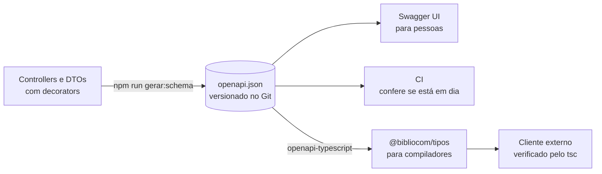

# M11 — Tipos compartilhados e contrato OpenAPI

> **Pré-requisitos:** M07, M10 · **Duração:** curta

Uma API profissional não é apenas um conjunto de rotas: ela tem um **contrato** que
clientes, testes e equipes conseguem consultar. Neste módulo, o schema que o Swagger gera
vira um artefato versionado, verificado no CI e transformado em tipos que um cliente
externo usa — e que o compilador confere por você.

> **A teoria não está num bloco separado.** Ela está nas etapas 1, 4 e 8 — em que a gente
> para de digitar e pensa — mais as explicações dentro de cada etapa.

## 🎯 Objetivos

Ao final você será capaz de:

1. Diferenciar a documentação visual do Swagger UI e o schema OpenAPI.
2. Versionar o `openapi.json` e revisar mudanças de contrato num *diff*.
3. Classificar mudanças como compatíveis ou incompatíveis, e decidir o que fazer com cada uma.
4. Impedir no CI que o contrato commitado e o código divirjam.
5. Gerar tipos a partir do contrato e usá-los num cliente que o compilador verifica.

---

## 🧭 Por que este módulo vem depois dos testes

O M10 verifica se a implementação **funciona**. O M11 verifica se ela continua **prometendo**
aos consumidores o que o contrato declara. São garantias diferentes, e ambas são necessárias:
uma API pode passar em todos os testes e, mesmo assim, quebrar todo mundo que a usa porque
um campo mudou de nome.

> A competência nova é pensar em **compatibilidade**. Uma API madura não é só a que
> funciona hoje: é a que consegue evoluir sem surpreender quem depende dela.



## 📋 Como este módulo funciona

Mesmo formato dos anteriores.

| Parte | O que é |
|---|---|
| **Faça** | O comando ou o código, para digitar |
| **Linha a linha** | Uma tabela explicando **cada elemento** |
| **Rode** | Como verificar |
| **Deu certo se** | O resultado exato esperado |

### As nove etapas

| # | Etapa | Duração | O que entra |
|---|---|---|---|
| 1 | [**O contrato é uma promessa**](#etapa-1--o-contrato-é-uma-promessa) | curta | **vitrine × planta** |
| 2 | [Regerar e versionar](#etapa-2--regerar-e-versionar) | curta | `gerar:schema` |
| 3 | [Ler um *diff* de contrato](#etapa-3--ler-um-diff-de-contrato) | curta | `git diff` |
| 4 | [**Compatível ou incompatível**](#etapa-4--compatível-ou-incompatível) | média | **o que quebra um cliente** |
| 5 | [O contrato no CI](#etapa-5--o-contrato-no-ci) | curta | `git diff --exit-code` |
| 6 | [O pacote de tipos](#etapa-6--o-pacote-de-tipos) | média | `openapi-typescript`, *workspace* |
| 7 | [Um consumidor externo](#etapa-7--um-consumidor-externo) | média | `openapi-fetch` |
| 8 | [**O que o compilador achou**](#etapa-8--o-que-o-compilador-achou) | média | **furos no contrato** |
| 9 | [Quebrar de propósito](#etapa-9--quebrar-de-propósito) | curta | a garantia em ação |

---

## Etapa 1 — O contrato é uma promessa

Pense no **padrão brasileiro de tomadas**. Quem fabrica geladeira e quem fabrica tomada não
se conhecem, e mesmo assim todo aparelho encaixa em toda parede. O que liga os dois é a
norma: o formato e a distância dos pinos. Se um fabricante de tomada mudar a distância por
conta própria, nenhum aparelho do país encaixa — e não adianta dizer que a tomada nova
"funciona".

O contrato da API é essa norma. E ele existe em duas formas:

| | **Swagger UI** (`/api/docs`) | **`openapi.json`** |
|---|---|---|
| Analogia | A **vitrine** da loja | A **planta** do prédio |
| Para quem | Pessoas, explorando | Programas: CI, geradores de código, ferramentas de teste |
| Onde vive | Só com a API no ar | No Git, junto do código, com histórico |
| Dá para comparar duas versões? | Não | Sim, com `git diff` |

O Swagger UI é gerado **a partir** do `openapi.json`. Este módulo trata a planta como o
artefato principal.

---

## Etapa 2 — Regerar e versionar

O M03 criou o `gerar:schema`. Desde então vieram as entidades, os DTOs, o login, a listagem
paginada. O arquivo está desatualizado.

**Faça**, com o banco no ar (`docker compose up -d`) — desde o M04, montar o `AppModule`
conecta ao PostgreSQL:

```powershell
npm run gerar:schema
```

**Rode:**

```powershell
git diff --stat backend/openapi.json
```

**Deu certo se:** o arquivo mudou bastante. Abra-o e procure `"/api/sessao"`,
`"/api/usuarios"` e `"PaginaDeObras"` — tudo que entrou depois do M03.

> **Se o `gerar:schema` acusar erro de lint** em `src\gerar-schema.ts`, confira se a última
> linha é `await gerar();`. Sem o `await`, o oxlint do M10 reclama de uma `Promise` solta.

**Faça:** commite o arquivo regerado, sozinho, com uma mensagem que diga o que é:

```powershell
git add backend/openapi.json
```

```powershell
git commit -m "docs(api): atualiza o contrato OpenAPI"
```

---

## Etapa 3 — Ler um *diff* de contrato

**Faça:** uma mudança pequena. No `ObraResumo` do M09, renomeie o campo `autor` para
`nomeAutor` — na classe e no método `de`. Depois:

```powershell
npm run gerar:schema
```

```powershell
git diff backend/openapi.json
```

**Deu certo se:** o *diff* mostra, dentro de `"ObraResumo"`:

```diff
-          "autor": {
+          "nomeAutor": {
             "type": "string"
           }
         },
         "required": [
           "id",
           "titulo",
           "anoPublicacao",
-          "autor"
+          "nomeAutor"
         ]
```

Uma linha mudada no código virou uma mudança **visível e revisável** na promessa pública.
Num *pull request*, quem revisa vê isto sem precisar ler o controller.

**Não desfaça ainda** — a próxima etapa precisa dela.

---

## Etapa 4 — Compatível ou incompatível

A pergunta que todo *diff* de contrato precisa responder: **um cliente que já existe continua
funcionando?**

| Mudança | Compatível? | Por quê |
|---|---|---|
| Acrescentar um campo **na resposta** | ✅ | Cliente que não conhece o campo simplesmente o ignora |
| Acrescentar um campo **opcional** na entrada | ✅ | Quem não envia continua válido |
| Acrescentar uma rota | ✅ | Ninguém dependia dela |
| **Renomear** ou **remover** um campo da resposta | ❌ | Quem lia `autor` passa a receber `undefined` |
| Tornar **obrigatório** um campo de entrada | ❌ | Requisições que funcionavam passam a receber `400` |
| Mudar o **tipo** de um campo | ❌ | `"1899"` não é `1899` para quem faz conta |
| Mudar o **significado** de um status | ❌ | Quem tratava `404` como "não existe" erra se ele passar a significar outra coisa |

A mudança da etapa 3 é **incompatível**. Há três jeitos honestos de fazê-la:

| Estratégia | Como | Quando |
|---|---|---|
| **Expandir e contrair** | Devolver `autor` **e** `nomeAutor` por um tempo; marcar `autor` como obsoleto; remover depois | Quase sempre — é o mesmo raciocínio do M05, aplicado ao contrato |
| **Nova versão** | `/api/v2/obras` com o formato novo, `/api/obras` intacto | Quando a mudança é grande demais para conviver |
| **Não fazer** | Concluir que o nome antigo é bom o bastante | Mais vezes do que parece |

Para marcar um campo como obsoleto, o próprio decorator ajuda — e o aviso aparece no Swagger
e nos tipos gerados:

```ts
@ApiProperty({ deprecated: true, description: "Use nomeAutor" })
autor: string;
```

**Faça:** desfaça a renomeação e regere o schema. O `git diff` deve ficar vazio.

💼 **No mercado:** APIs públicas grandes publicam uma política de compatibilidade — quanto
tempo um campo obsoleto continua existindo. Quem consome agradece; quem quebra cliente sem
aviso perde cliente.

---

## Etapa 5 — O contrato no CI

O risco agora é o esquecimento: alguém muda um DTO, não roda o `gerar:schema`, e o
`openapi.json` do Git passa a mentir.

**Faça:** um atalho no `backend\package.json`:

```json
"contrato:verificar": "npm run gerar:schema && git diff --exit-code openapi.json"
```

| Trecho | O que faz |
|---|---|
| `npm run gerar:schema` | Gera o contrato a partir do código atual |
| `git diff --exit-code openapi.json` | Compara com o que está commitado. Sem diferença, termina com sucesso; **com** diferença, mostra o *diff* e termina com erro |
| `&&` | O segundo comando só roda se o primeiro deu certo. Dentro de um script do npm, funciona igual no Windows |

**Rode:**

```powershell
npm run contrato:verificar
```

**Deu certo se:** termina sem erro. Agora mude a descrição de um `@ApiProperty` qualquer,
rode de novo e veja o *diff* aparecer com erro. Desfaça.

**Faça:** acrescente ao `.github\workflows\ci.yml` do M10, depois do passo das migrações (o
banco já está no ar):

```yaml
      - name: Contrato OpenAPI em dia
        run: npm run contrato:verificar -w backend
```

> O que o M07 (exercício E07.8) propôs, agora como regra: **o contrato não pode divergir do
> código sem que alguém perceba**.

---

## Etapa 6 — O pacote de tipos

O `openapi.json` descreve os formatos. Um cliente em TypeScript pode transformar essa
descrição em **tipos** — e, a partir daí, o compilador confere cada uso.

**Faça:** o pacote que o M00 deixou declarado no *workspace*. Na raiz do repositório:

```powershell
New-Item -ItemType Directory pacotes\tipos\src, pacotes\tipos\exemplos
```

**Faça:** crie `pacotes\tipos\package.json`:

```json
{
  "name": "@bibliocom/tipos",
  "version": "1.0.0",
  "private": true,
  "type": "module",
  "types": "./src/api.d.ts",
  "scripts": {
    "gerar": "openapi-typescript ../../backend/openapi.json -o src/api.d.ts",
    "verificar": "tsc --noEmit"
  }
}
```

| Campo | O que faz |
|---|---|
| `"name": "@bibliocom/tipos"` | O nome pelo qual outros pacotes do *workspace* o importam |
| `"types"` | Onde estão os tipos. Este pacote **não tem JavaScript**: só descreve formatos |
| `gerar` | Lê o contrato do backend e escreve os tipos |
| `verificar` | Roda o compilador sem gerar arquivo nenhum: só confere |

**Faça**, da raiz:

```powershell
npm install -D openapi-typescript typescript@5 -w @bibliocom/tipos
```

```powershell
npm install openapi-fetch -w @bibliocom/tipos
```

| Trecho | O que faz |
|---|---|
| `-w @bibliocom/tipos` | Instala **neste** pacote do *workspace*, e não no backend |
| `typescript@5` | O `openapi-typescript` pede o TypeScript 5. O backend usa o 6, e o *workspace* guarda as duas versões, cada uma onde é pedida |
| `openapi-fetch` | Um cliente HTTP pequeno que **lê os tipos gerados**. Entra na etapa 7 |

**Faça:**

```powershell
npm run gerar -w @bibliocom/tipos
```

**Deu certo se:** aparece `🚀 ../../backend/openapi.json → src/api.d.ts`. Abra o arquivo e
procure `PaginaDeObras`:

```ts
PaginaDeObras: {
    itens: components["schemas"]["ObraResumo"][];
    total: number;
    pagina: number;
    tamanho: number;
};
```

É o seu DTO do M09, escrito de novo — só que **por uma ferramenta**, a partir do contrato.
Ninguém precisa manter os dois em sincronia à mão.

> O `src/api.d.ts` é gerado: não o edite. Ele vai para o Git para que quem clonar o
> repositório consiga compilar o cliente sem rodar o backend.

---

## Etapa 7 — Um consumidor externo

Um cliente de verdade não importa nada de `backend/`. Ele só conhece o contrato.

**Faça:** crie `pacotes\tipos\tsconfig.json`:

```json
{
  "compilerOptions": {
    "target": "ES2023",
    "module": "nodenext",
    "moduleResolution": "nodenext",
    "strict": true,
    "noEmit": true,
    "allowImportingTsExtensions": true,
    "skipLibCheck": true
  },
  "include": ["src", "exemplos"]
}
```

**Faça:** crie `pacotes\tipos\exemplos\listar-obras.ts`:

```ts
import createClient from "openapi-fetch";
import type { paths } from "../src/api.d.ts";

// Um consumidor externo: conhece a API só pelo contrato.
const api = createClient<paths>({ baseUrl: process.env.API_URL ?? "http://localhost:3000" });

const { data, response } = await api.GET("/api/obras", {
  params: { query: { pagina: 1, tamanho: 5 } },
});

if (!data) {
  console.error(`Falhou com ${response.status}`);
  process.exit(1);
}

for (const obra of data.itens) {
  console.log(`${obra.id} · ${obra.titulo} (${obra.anoPublicacao ?? "s/d"}) — ${obra.autor}`);
}
console.log(`${data.itens.length} de ${data.total}`);
```

**Linha a linha:**

| Trecho | O que faz |
|---|---|
| `import type { paths }` | Importa **só tipos**: o mapa de todas as rotas, com entrada e saída de cada uma |
| `createClient<paths>(…)` | Um cliente HTTP que conhece o mapa. Ele recusa, em tempo de compilação, rota que não existe |
| `api.GET("/api/obras", …)` | O caminho é conferido contra o contrato: um erro de digitação aqui é erro de compilação |
| `params: { query: {…} }` | Os parâmetros de consulta, também conferidos |
| `if (!data)` | `data` só existe quando a resposta foi de sucesso. Depois deste `if`, o compilador sabe que ela existe |
| `obra.titulo`, `obra.autor` | Os campos do `ObraResumo`. Escreva `obra.autr` e veja o editor sublinhar na hora |

**Rode** o compilador:

```powershell
npm run verificar -w @bibliocom/tipos
```

**Deu certo se** — de novo, "certo" é encontrar problema. Muito provavelmente aparece algo
assim:

```
exemplos/listar-obras.ts(8,13): error TS2322: Type '{ pagina: number; tamanho: number; }' is not assignable to type 'undefined'.
```

O cliente está correto. Quem está errado é o **contrato**. A próxima etapa explica.

---

## Etapa 8 — O que o compilador achou

O erro diz que `GET /api/obras` **não aceita parâmetros de consulta** — segundo o contrato.
Mas a rota aceita `pagina`, `tamanho` e `busca` desde o M07. Abra o `openapi.json` e procure
`"/api/obras"`: a lista `parameters` está vazia, ou com tipos estranhos.

O problema está no `ListarObrasDto`:

```ts
@IsOptional() @Type(() => Number) @IsInt() @Min(1)
pagina = 1;
```

| O que falta | Consequência no contrato |
|---|---|
| `@ApiPropertyOptional` | O Swagger não sabe que o campo existe: o parâmetro some do contrato |
| O tipo **escrito** (`: number`) | Sem ele, o decorator enxerga só "um objeto qualquer", e o contrato diz `Object` |

Os validadores do `class-validator` garantem a **entrada**; os decorators do Swagger
**anunciam** o contrato. São duas coisas, e o M07 só fez a primeira para a query. Ninguém
percebeu porque a rota funcionava — foi preciso um consumidor rigoroso para notar.

**Faça:** corrija o `src\acervo\dto\listar-obras.dto.ts`:

```ts
import { ApiPropertyOptional } from "@nestjs/swagger";
import { Type } from "class-transformer";
import { IsInt, IsOptional, IsString, Length, Max, Min } from "class-validator";

export class ListarObrasDto {
  @ApiPropertyOptional({ default: 1, minimum: 1 })
  @IsOptional() @Type(() => Number) @IsInt() @Min(1)
  pagina: number = 1;

  @ApiPropertyOptional({ default: 20, minimum: 1, maximum: 100 })
  @IsOptional() @Type(() => Number) @IsInt() @Min(1) @Max(100)
  tamanho: number = 20;

  @ApiPropertyOptional({ example: "casmurro" })
  @IsOptional() @IsString() @Length(1, 100)
  busca?: string;
}
```

**Faça** — a sequência completa, que você vai repetir a cada mudança de contrato:

```powershell
npm run gerar:schema -w backend
```

```powershell
npm run gerar -w @bibliocom/tipos
```

```powershell
npm run verificar -w @bibliocom/tipos
```

**Deu certo se:** o `verificar` termina sem erro. E o Swagger UI agora mostra os três
parâmetros em `GET /api/obras`, com o teto de 100 no `tamanho`.

### Mais um furo, este mais discreto

Abra o `src/api.d.ts` e procure o `ObraResumo`:

```ts
anoPublicacao: {} | null;
```

Um **objeto** ou nulo — e não um número. O compilador não reclamou porque o cliente só
imprime o valor; um cliente que fizesse conta com o ano não compilaria. A causa é parecida
com a anterior: para `number | null`, o decorator não consegue descobrir o tipo sozinho (com
o `|`, ele só enxerga "objeto"), e o contrato herda o engano.

**Faça:** no `ObraResumo` (M09) **e** no `ObraResposta` (M07), diga o tipo por extenso:

```ts
@ApiProperty({ type: Number, nullable: true }) anoPublicacao: number | null;
```

Repita a sequência das três linhas. **Deu certo se:** o `api.d.ts` mostra
`anoPublicacao: number | null;`.

| Regra prática para o contrato | Exemplo |
|---|---|
| Todo campo que deve aparecer tem decorator do Swagger, **inclusive na query** | `@ApiPropertyOptional()` |
| Toda propriedade tem o tipo **escrito** | `pagina: number = 1`, não `pagina = 1` |
| Tipo com `\|` (união, `null`) recebe o `type` explícito | `{ type: Number, nullable: true }` |

**Rode** o cliente de verdade, com a API no ar:

```powershell
node pacotes\tipos\exemplos\listar-obras.ts
```

**Deu certo se:** aparece a lista de obras e a linha `N de M`. O Node 24 executa o arquivo
`.ts` direto: ele descarta as anotações de tipo e roda o resto.

> Esta etapa é o argumento do módulo inteiro: o contrato estava **errado desde o M07** e
> nenhum teste, nenhum `curl` e nenhuma revisão notou. O primeiro consumidor tipado notou em
> segundos.

---

## Etapa 9 — Quebrar de propósito

**Faça:** repita a renomeação da etapa 3 (`autor` → `nomeAutor` no `ObraResumo`) e rode a
sequência das três linhas da etapa 8.

**Deu certo se:** o `verificar` falha **no cliente**:

```
exemplos/listar-obras.ts(17,86): error TS2339: Property 'autor' does not exist on type '{ id: number; titulo: string; anoPublicacao: number | null; nomeAutor: string; }'.
```

Sem rodar nada, sem servidor no ar: o compilador avisou que **este cliente quebraria** com a
mudança. Num projeto com vários consumidores, cada um com o seu `verificar` no CI, uma
mudança incompatível fica vermelha antes do *merge*.

**Faça:** desfaça a renomeação e rode a sequência de novo. Tudo verde.

**Faça:** acrescente ao CI, junto do passo do contrato:

```yaml
      - name: Clientes compilam contra o contrato
        run: |
          npm run gerar -w @bibliocom/tipos
          npm run verificar -w @bibliocom/tipos
```

---

## 🤖 IA no fluxo

O `openapi.json` é um ótimo contexto para um assistente de IA: em vez de colar controllers,
entregue o contrato e peça *"escreva um cliente para listar as obras"* ou *"liste as mudanças
incompatíveis entre estas duas versões"*. Ele trabalha só com o que é público — como um
consumidor de verdade.

O que continua sendo seu: decidir se uma mudança incompatível vale o custo, e por quanto
tempo um campo obsoleto convive com o novo. Isso depende de quem usa a API, e o contrato não
diz.

## ⚠️ Erros comuns

| Sintoma | Diagnóstico |
|---|---|
| `gerar:schema` falha com `ECONNREFUSED` | O banco não está no ar. Desde o M04, montar o `AppModule` conecta ao PostgreSQL |
| `contrato:verificar` falha no CI e passa local | O `openapi.json` local foi regerado e não commitado |
| Parâmetro da query não aparece no Swagger | Falta `@ApiPropertyOptional` no DTO da query — etapa 8 |
| Campo aparece como `Object` no contrato | Falta o tipo escrito na propriedade (`: number`) — etapa 8 |
| `Cannot find module 'openapi-fetch'` | Instalou no pacote errado. Use `-w @bibliocom/tipos`, da raiz |
| `ERR_UNKNOWN_FILE_EXTENSION ".ts"` ao rodar o exemplo | Node anterior ao 22.18. O curso usa o Node 24 |
| Campo `number \| null` vira `{} \| null` nos tipos | Falta `type: Number` no `@ApiProperty` — etapa 8 |

## 💣 Pegadinha de mercado

**"É só um campo renomeado."** Do lado de quem muda, é uma linha. Do lado de quem consome, é
um erro em produção às três da manhã, sem nenhum aviso — a resposta continua `200`, só que o
campo que o cliente lia agora é `undefined`. Mudança incompatível não se faz em silêncio: ou
se mantém o campo antigo por um tempo, ou se cria uma versão nova, e em qualquer caso se
**avisa**.

## ✅ Checklist de saída

- [ ] `openapi.json` regerado e versionado
- [ ] Você leu um *diff* de contrato e classificou a mudança
- [ ] `contrato:verificar` no CI, e você o viu falhar
- [ ] `@bibliocom/tipos` gerado a partir do contrato
- [ ] Um cliente externo compila e roda contra a API usando só o contrato
- [ ] Os furos que o compilador achou foram corrigidos **no backend**
- [ ] Uma mudança incompatível quebrou o `verificar`, e foi desfeita

## 📦 Entrega E7

O `openapi.json` atualizado, o pacote `@bibliocom/tipos` com o cliente de exemplo, os dois
passos novos do CI verdes, e um registro curto (pode ser no README) de uma mudança
compatível e uma incompatível — com o que você faria em cada caso.

## 🧩 Desafio de fixação

A coordenação pede que `GET /api/obras` passe a devolver também a `sinopse` de cada obra.
É uma mudança compatível? E se pedisse para **trocar** `anoPublicacao` (número) por
`dataPublicacao` (texto no formato `AAAA-MM-DD`)? Para a segunda, desenhe o caminho
expandir → contrair: quais versões do contrato existiriam, e em que ordem?

## 🧪 Exercícios

Ver [`exercicios.md`](exercicios.md).

## 📚 Para aprofundar

- [OpenAPI Specification](https://spec.openapis.org/oas/latest.html)
- [NestJS — OpenAPI](https://docs.nestjs.com/openapi/introduction)
- [openapi-typescript e openapi-fetch](https://openapi-ts.dev/)
- [Semantic Versioning](https://semver.org/lang/pt-BR/)
