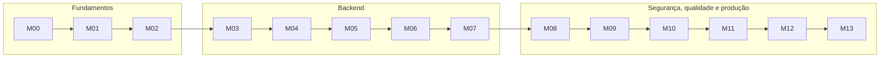

# Módulos de conteúdo

14 módulos, de M00 a M13. A sequência foi pensada como uma progressão de aprendizagem, não como uma lista de tópicos:

- M00–M02 constroem o modelo mental do aluno para web, API e projeto.
- M03–M07 transformam esse entendimento em uma API funcional e documentada.
- M08–M09 adicionam segurança e autonomia crítica sobre risco real.
- M10–M11 consolidam qualidade, contrato e confiabilidade do código.
- M12–M13 fecham a jornada com operação e manutenção em ambiente real.

Cada módulo é autocontido e segue a mesma estrutura:

```
README.md          Objetivos · Etapas guiadas · Erros comuns · Checklist · No mercado
exercicios.md      Atividades sem passo a passo, com critérios de verificação
```

A **Duração** de cada módulo é relativa — curta, média ou longa — e serve para calibrar o
fôlego. A carga horária oficial está no [plano de ensino](../docs/plano-de-ensino.md) e no
[cronograma](../docs/cronograma.md).

## Trilha

### Como ler esta trilha

Cada bloco responde a uma pergunta concreta para o aluno:

| Bloco | Pergunta central | Resultado esperado |
| --- | --- | --- |
| M00–M02 | “Como o software funciona antes de ser escrito?” | ambiente, HTTP, contrato e visão de sistema |
| M03–M07 | “Como construir uma API que faça sentido e seja documentada?” | backend funcional, dados, CRUD e API pública |
| M08–M09 | “Como proteger o que foi construído?” | autenticação, autorização e análise de risco |
| M10–M11 | “Como garantir qualidade e continuidade sem quebrar o contrato?” | testes, validação e schema compartilhado |
| M12–M13 | “Como entregar e manter o sistema em operação?” | deploy, observabilidade e manutenção |

### Bloco 1 — Fundamentos

| # | Módulo | Duração | Entrega |
| --- | --- | --- | --- |
| [00](00-ambiente-e-ferramentas/) | Ambiente e ferramentas | média | Ambiente validado |
| [01](01-fundamentos-web-http/) | Fundamentos da web e HTTP | longa | **E0** — relatório de inspeção HTTP |
| [02](02-arquitetura-desacoplada/) | Arquitetura desacoplada e contrato de API | curta | Contrato do BiblioCom |

### Bloco 2 — Backend: aplicação, dados e API

| # | Módulo | Duração | Entrega |
| --- | --- | --- | --- |
| [03](03-nestjs-primeiros-passos/) | NestJS: a primeira API, passo a passo | média | API respondendo JSON + Swagger UI em `/api/docs` |
| [04](04-entidades-typeorm/) | Entidades: classes que geram o banco | longa | **E1** — modelo de dados |
| [05](05-migracoes/) | Migrações | média | Migrações versionadas |
| [06](06-orm-consultas-crud/) | Repository e QueryBuilder: consultas e CRUD | longa | **E2** — caderno de consultas |
| [07](07-api-controllers-dtos/) | API: rotas, controllers, DTOs e documentação Swagger | longa | **E3** — API documentada, com OpenAPI versionado |

### Bloco 3 — Segurança, qualidade e operação

| # | Módulo | Duração | Entrega |
| --- | --- | --- | --- |
| [08](08-autenticacao-usuarios/) | Autenticação e autorização na API | longa | **E4** — login e rotas protegidas |
| [09](09-seguranca/) | Segurança de APIs | longa | **E5** — checklist OWASP |
| [10](10-testes-e-qualidade/) | Testes e qualidade no backend | média | **E6** — suíte de API verde |
| [11](11-tipos-compartilhados/) | Tipos compartilhados e contrato OpenAPI | curta | **E7** — schema versionado e integração de cliente |
| [12](12-deploy/) | Deploy da API | média | **E8** — API no ar |
| [13](13-observabilidade-e-manutencao/) | Observabilidade e manutenção da API | curta | Operação documentada |

## Dependências entre módulos



**A regra que estrutura o curso:** cada módulo acrescenta uma camada executável ao mesmo
backend. O Swagger nasce no M03, é completado no M07 e acompanha a API até o deploy.

**Pense na sequência como desenvolvimento de competência:**

- primeiro o aluno entende a base;
- depois monta a aplicação;
- em seguida protege e valida;
- por fim entrega e opera.

**Não pule** M01, M02, M04, M05 e M07: todo o resto depende deles.

## Estudo de caso: BiblioCom

Todos os módulos constroem o mesmo sistema, incrementalmente.

| Módulo | O que o BiblioCom ganha |
| --- | --- |
| M02 | Contrato de API definido (recursos, rotas, formatos) |
| M03 | `backend/` (NestJS) respondendo JSON, com Swagger UI e schema OpenAPI configurados |
| M04 | `Autor`, `Obra`, `Categoria`, `Exemplar`, `Associado`, `Emprestimo` |
| M05 | Migrações versionadas e PostgreSQL reproduzível |
| M06 | Consultas de catálogo, disponibilidade, atrasos, relatórios |
| M07 | `/api/obras`, `/api/emprestimos`, filtros, paginação e documentação Swagger/OpenAPI revisada |
| M08 | Login, papéis e rotas protegidas na API |
| M09 | Correção de vulnerabilidades da API |
| M10 | Vitest/Supertest, lint e CI do backend |
| M11 | Schema OpenAPI versionado e integração de cliente |
| M12 | API no ar, HTTPS, banco gerenciado e CI/CD |
| M13 | Logs, healthcheck, backup e plano de manutenção |
