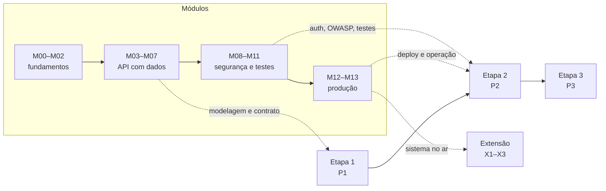

# Projeto Integrador e extensão

O projeto é o eixo da disciplina: os módulos existem para viabilizá-lo. Ele é feito em
**equipes de 3 a 4 pessoas**, sobre um tema escolhido pela própria equipe, e atendendo a
uma **demanda real de uma organização parceira** — o que caracteriza a dimensão
extensionista.

## Estrutura

| Etapa | Entrega | Peso |
| --- | --- | ---: |
| [1. Definição e planejamento](etapa-1-definicao-do-tema/) | **P1** — Documento de definição e planejamento | 15% |
| [2. Desenvolvimento do sistema](etapa-3-desenvolvimento/) | **P2** — Sistema desenvolvido, testado e implantado | 30% |
| [3. Relatório técnico e encerramento](etapa-4-relatorio-e-encerramento/) | **P3** — Relatório + apresentação | 10% |
| [Atividades extensionistas](extensao/) | **X1–X3** — Plano, evidências e relato | 10% |
| **Total** | | **55%** |

Datas e carga horária no [cronograma](../docs/cronograma.md). O desenvolvimento acontece
também fora das aulas dedicadas ao projeto, apoiado pelas atividades práticas dos módulos:
cada módulo entrega uma peça que o projeto reaproveita.

## Como as etapas se conectam aos módulos

Ao chegar na Etapa 2, a equipe **já sabe** modelar, consultar, roteirizar, validar,
autenticar, proteger, testar e implantar. A Etapa 2 é integração, não
descoberta.

## Regras do projeto

### Escopo

- **MVP obrigatório:** 3 a 5 funcionalidades que resolvam o problema central.
- **Escopo reduzido para backend:** a entrega focará na API e na regra de negócio, sem
  interface web. O mínimo técnico passa a ser: 🔵 5+ models com relações 1-N e N-N; API REST
  com CRUD completo em 2+ recursos, validação, filtros e paginação; documentação interativa
  com **Swagger em `/api/docs`**, schema OpenAPI versionado e exemplos de respostas e erros;
  ⚪ autenticação com 2+ papéis ponta a ponta; 15+ testes no backend; **artefato implantado**
  com URL pública.
  Lista completa em
  [`etapa-3-desenvolvimento/`](etapa-3-desenvolvimento/#3-requisitos-técnicos-mínimos-verificados-na-rubrica).
- **Fora do escopo:** frontend/SPA, app mobile nativo, integração com meio de pagamento,
  IA/ML. Se a equipe quiser, faz depois da disciplina.

### Tema

- Um tema por equipe (sem repetição na turma).
- Precisa de uma **organização parceira real** com uma demanda real.
- Aprovado pelo docente na Etapa 1 — o filtro de escopo existe justamente para evitar o
  fracasso previsível de um projeto grande demais.
- **Não** pode ser: clone de rede social, "sistema de gestão" genérico sem cliente,
  ou reimplementação do BiblioCom.

### Trabalho em equipe

- Repositório único por equipe, na organização da turma.
- Branch `main` protegida: só entra por Pull Request com CI verde e 1 aprovação.
- Todos commitam. Histórico por autor é instrumento de avaliação.
- Papéis rotativos por etapa: *Product Owner*, *Tech Lead*, *Scribe*, *Ops*.
- Contrato de equipe assinado na Etapa 1.

### Avaliação individualizada

A nota do projeto é da equipe, ajustada por um **fator de participação individual**
(0,7 a 1,1), definido a partir de: histórico de commits, avaliação por pares, e arguição
individual na apresentação — onde cada pessoa responde sobre uma parte do código que
**não** escreveu.

## Entregas e prazos

| Código | Entrega | Semana | Formato |
| --- | --- | ---: | --- |
| P1 | Documento de definição e planejamento (contrato, backlog, modelo, ADRs, riscos) | 10 | PDF + repositório |
| X1 | Plano de ação extensionista | 15 | PDF |
| P2 | Sistema (código + URL pública + testes) | 18 | Repositório + URL |
| X2 | Evidências da ação extensionista | 19 | Pasta de evidências |
| P3 | Relatório técnico + apresentação | 19–20 | PDF + slides + apresentação oral |
| X3 | Relato de experiência | 20 | PDF (no relatório) |

## Modelos de documentos

Todos os documentos exigidos têm modelo pronto em
[`modelos-de-documentos/`](modelos-de-documentos/). Use-os: eles refletem exatamente o que
a rubrica avalia.

| Documento | Etapa |
| --- | --- |
| [Canvas do projeto](modelos-de-documentos/canvas-do-projeto.md) | 1 |
| [Termo de abertura](modelos-de-documentos/termo-de-abertura.md) | 1 |
| [Carta de anuência](modelos-de-documentos/carta-de-anuencia.md) | 1 |
| [Contrato de equipe](modelos-de-documentos/contrato-de-equipe.md) | 1 |
| [Backlog e histórias](modelos-de-documentos/backlog-e-historias.md) | 1 |
| [Matriz de riscos](modelos-de-documentos/matriz-de-riscos.md) | 1 |
| [ADR](modelos-de-documentos/adr.md) | 1–2 |
| **Contrato de API** (ver M02) | 2 |
| [Ata de reunião](modelos-de-documentos/ata-de-reuniao.md) | todas |
| [Plano de teste](modelos-de-documentos/plano-de-teste.md) | 2 |
| [Relatório técnico](modelos-de-documentos/relatorio-tecnico.md) | 3 |
| [Relato de experiência](modelos-de-documentos/relato-de-experiencia.md) | 3 / extensão |
| [Avaliação por pares](modelos-de-documentos/avaliacao-por-pares.md) | 3 |
| [Termo de transferência](modelos-de-documentos/termo-de-transferencia.md) | 3 |

## Rubricas

As rubricas de cada etapa estão em [`../avaliacao/`](../avaliacao/). Leia-as **antes** de
começar cada etapa: elas dizem exatamente o que será verificado.
