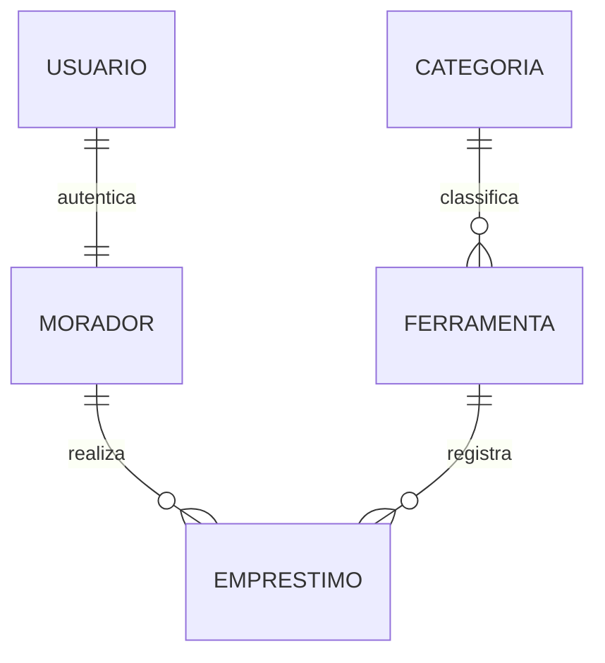

# Etapa 2 — Planejamento do projeto

> **CH:** 4h (1h teórica · 3h práticas) · **Semanas 8, 9 e 11** · **Entrega P2** (semana 11) · **Peso:** 7,5%

## Atividades previstas

- Articulação da equipe sobre aspectos do trabalho em grupo
- Criação de documentos de planejamento

## 🎯 O que esta etapa produz

O acordo interno (como a equipe trabalha) e o acordo externo (o que será construído, em
que ordem, com que riscos).

---

## 1. Articulação da equipe (1h30)

### 1.1 Contrato de equipe

Documento assinado por todos, respondendo:

| Tema | Perguntas a responder |
|---|---|
| **Comunicação** | Qual canal? Prazo máximo de resposta? Quando é aceitável ligar? |
| **Reuniões** | Quando, onde, quanto tempo? Quem conduz? Quem registra? |
| **Disponibilidade** | Quantas horas por semana cada pessoa consegue, realisticamente? |
| **Decisões** | Consenso? Voto? Quem desempata? |
| **Código** | Padrão de branch, commit, PR. Quantas aprovações? |
| **Definition of Done** | O que precisa estar pronto para uma tarefa contar como feita |
| **Conflitos** | Como tratamos discordância técnica? E falta de entrega? |
| **Ausências** | Como avisar? O que acontece com a tarefa? |

Modelo em [`../modelos-de-documentos/contrato-de-equipe.md`](../modelos-de-documentos/contrato-de-equipe.md).

> A pergunta sobre disponibilidade real é a mais importante e a mais evitada. Uma equipe
> em que uma pessoa tem 10h/semana e outra tem 2h precisa **saber disso na semana 8**, e
> planejar com esse número — não descobrir na semana 18.

### 1.2 Papéis rotativos

| Papel | Responsabilidade | Rotaciona |
|---|---|---|
| **Product Owner** | Fala com a organização parceira; prioriza o backlog; decide escopo | A cada etapa |
| **Tech Lead** | Arquitetura, revisão de código, padrões técnicos | A cada etapa |
| **Scribe** | Atas, documentação, relatório | A cada etapa |
| **Ops** | Repositório, CI, deploy, ambientes, credenciais | A cada etapa |

Rotacionar garante que todos passem por todas as competências — o que a arguição
individual da Etapa 4 vai verificar.

### 1.3 Definition of Done

Acordem o padrão. Sugestão de base:

- [ ] Código na branch, com PR aberto
- [ ] CI verde (lint + testes)
- [ ] Ao menos 1 revisão aprovada por outra pessoa
- [ ] Testes cobrindo a regra de negócio nova
- [ ] Funciona no ambiente de staging
- [ ] Critérios de aceite da história verificados
- [ ] Documentação atualizada, se aplicável

---

## 2. Documentos de planejamento (2h30)

### 2.1 Backlog e histórias de usuário

```
Como <papel>, quero <ação>, para <benefício>.
```

```markdown
### H07 — Registrar empréstimo de ferramenta

**Como** secretária da associação
**quero** registrar que uma ferramenta foi emprestada a um morador
**para** saber, a qualquer momento, com quem está cada ferramenta.

**Critérios de aceite**
- [ ] Só ferramentas disponíveis aparecem na lista
- [ ] Só moradores cadastrados e adimplentes podem pegar
- [ ] O sistema calcula e exibe a data prevista de devolução (7 dias)
- [ ] A mesma ferramenta não pode ser emprestada duas vezes sem devolução
- [ ] Após registrar, a tela mostra confirmação com a data
- [ ] Todo o fluxo cabe em menos de 1 minuto no celular

**Prioridade:** Must · **Estimativa:** 5 pontos · **Depende de:** H03, H05
```

Priorize com **MoSCoW**: *Must* (sem isso o sistema não existe), *Should* (importante),
*Could* (desejável), *Won't* (fora desta versão — e escrever isso é o mais valioso).

Regra de escopo: o MVP é composto **apenas** de Must, e precisa caber com folga no tempo
disponível.

### 2.2 Modelo de dados

Diagrama entidade-relacionamento (Mermaid), com:

- todas as entidades e atributos principais;
- cardinalidades;
- a política de `on_delete` de cada relação, **justificada** (M03);
- as restrições de integridade que expressam as regras de negócio.

````markdown

````

### 2.3 Arquitetura e ADRs

Registre as decisões técnicas relevantes no formato
[ADR](../modelos-de-documentos/adr.md). Mínimo de 3:

- escolha de stack e justificativa;
- estratégia de autenticação e papéis;
- decisão de escopo técnico relevante (ex.: por que não haverá app mobile).

Inclua também o **desenho da arquitetura** (mesmo que simples) e a divisão em apps.

### 2.4 Matriz de riscos

| Risco | Prob. | Impacto | Exposição | Mitigação | Plano B | Responsável |
|---|:---:|:---:|:---:|---|---|---|
| Organização parceira fica indisponível | M | A | Alta | Reunião quinzenal agendada; 2º contato na organização | Validar com usuários finais | PO |
| Integrante com sobrecarga externa | A | M | Alta | Disponibilidade declarada; tarefas menores | Redistribuir na retrospectiva | Todos |
| Escopo cresce durante o projeto | A | A | Crítica | Escopo declarado por escrito; mudança só troca item por item | Cortar *Should* e *Could* | PO |
| Plano gratuito da PaaS mudar | B | A | Média | Deploy testado em 2 plataformas | Migrar para a alternativa | Ops |
| Perda de código | B | A | Média | Tudo no GitHub, push diário | Recuperar do remoto | Ops |

Riscos de exposição **Alta** ou **Crítica** precisam de mitigação **ativa**, não de
torcida.

### 2.5 Cronograma

Quadro semanal do que será feito, de agora até a semana 20, com marcos:

| Semana | Foco | Entregável | Responsáveis |
|---|---|---|---|
| 12 | Models e migrações | Esquema completo | |
| 13 | CRUD principal | H01–H04 | |
| ... | | | |

Use o quadro de projeto do GitHub (Projects), com as histórias como issues. Assim
planejamento e execução vivem no mesmo lugar, e o docente acompanha o progresso sem
precisar pedir relatório.

### 2.6 Protótipo de baixa fidelidade

Rascunhos das telas principais (papel, Figma, Excalidraw — o que for mais rápido).
Objetivo: **validar o fluxo com a organização parceira antes de escrever código**.

Mostre à Dona Marli. Se ela não entender a tela em papel, não vai entender em HTML.

---

## 📦 Entrega P2 — Plano do projeto

**Prazo:** semana 11 · **Formato:** PDF + arquivos no repositório (`docs/`)

1. Contrato de equipe assinado
2. Papéis definidos, com o plano de rotação
3. Definition of Done
4. Backlog completo, priorizado (MoSCoW), com critérios de aceite nos *Must*
5. Modelo de dados (diagrama + justificativa dos `on_delete`)
6. Arquitetura + no mínimo 3 ADRs
7. Matriz de riscos com mitigações
8. Cronograma até a semana 20
9. Protótipo das telas principais
10. Evidência de validação do protótipo com a organização parceira (ata + foto/print)
11. Link do quadro de projeto (GitHub Projects) já populado

Rubrica em [`../../avaliacao/rubrica-etapa-2.md`](../../avaliacao/rubrica-etapa-2.md).

## ⚠️ Erros que comprometem esta etapa

| Erro | Consequência |
|---|---|
| Contrato de equipe genérico ("vamos nos comunicar bem") | Não resolve nada quando o conflito aparece |
| Histórias sem critério de aceite | Ninguém sabe quando terminou |
| Backlog com tudo marcado como *Must* | Não houve priorização |
| Riscos genéricos ("pode dar problema") | Não é gestão de risco |
| Cronograma sem folga | A primeira imprevisão derruba tudo |
| Protótipo não validado com o parceiro | Retrabalho garantido na Etapa 3 |
| Planejamento que ninguém consulta depois | Documento decorativo; use o quadro |
